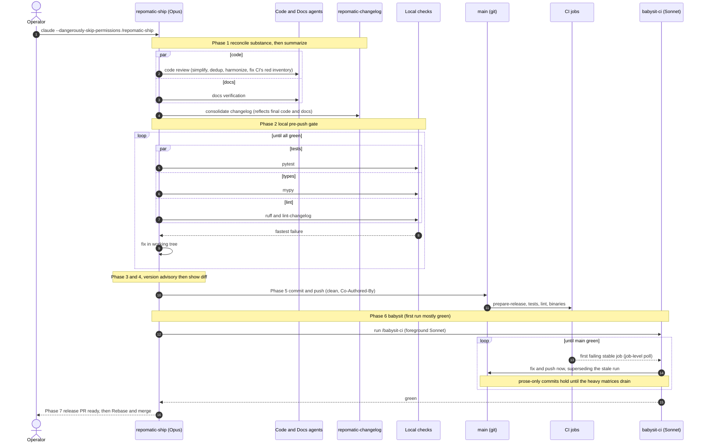
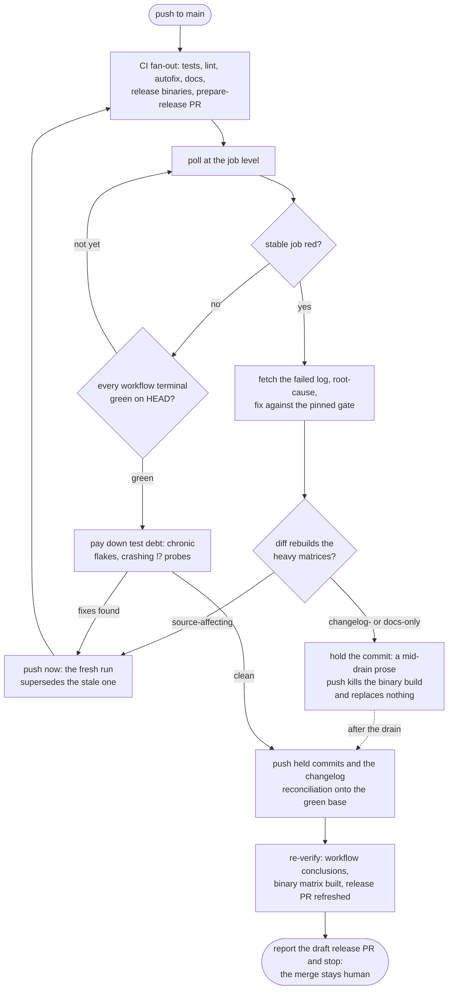

# {octicon}`mortar-board` Agent skills

This repository includes [Agent Skills](https://agentskills.io/specification) that bring `repomatic` workflows into your agent as slash commands. Downstream repositories can install them with:

```shell-session
$ uvx -- repomatic init skills
```

To install a single skill:

```shell-session
$ uvx -- repomatic init skills/repomatic-topics
```

Selectors use the same `component[/file]` syntax as the `exclude` config option in [`[tool.repomatic]`](configuration.md).

These same skills are also published as a Claude Code plugin, which installs them without committing any copy to your repository: see [§ Claude Code plugin](claude-code-plugin.md).

To list all available skills with descriptions:

```{click:run}
from repomatic.cli.main import repomatic
invoke(repomatic, args=['list-skills'])
```

## Available skills

| Phase       | Skill                                                                                                                      | Description                                                                                       |
| :---------- | :------------------------------------------------------------------------------------------------------------------------- | :------------------------------------------------------------------------------------------------ |
| Setup       | [`/repomatic-init`](https://github.com/kdeldycke/repomatic/blob/main/.claude/skills/repomatic-init/SKILL.md)               | Bootstrap a repository with reusable workflows                                                    |
| Development | [`/benchmark-update`](https://github.com/kdeldycke/repomatic/blob/main/.claude/skills/benchmark-update/SKILL.md)           | Create or update a competitive benchmark page comparing the project against alternatives          |
| Development | [`/brand-assets`](https://github.com/kdeldycke/repomatic/blob/main/.claude/skills/brand-assets/SKILL.md)                   | Create and export project logo/banner SVG assets to light/dark PNG variants                       |
| Development | [`/repomatic-deps`](https://github.com/kdeldycke/repomatic/blob/main/.claude/skills/repomatic-deps/SKILL.md)               | Dependency graphs, declaration audit, and changelog-driven code modernization                     |
| Development | [`/repomatic-topics`](https://github.com/kdeldycke/repomatic/blob/main/.claude/skills/repomatic-topics/SKILL.md)           | Optimize GitHub topics for discoverability                                                        |
| Quality     | [`/babysit-ci`](https://github.com/kdeldycke/repomatic/blob/main/.claude/skills/babysit-ci/SKILL.md)                       | Monitor CI tests, lint, autofix, docs, and Nuitka binary builds until all stable jobs pass        |
| Quality     | [`/repomatic-test-matrix`](https://github.com/kdeldycke/repomatic/blob/main/.claude/skills/repomatic-test-matrix/SKILL.md) | Choose the Python versions, operating systems and runner images the CI matrix covers              |
| Maintenance | [`/awesome-triage`](https://github.com/kdeldycke/repomatic/blob/main/.claude/skills/awesome-triage/SKILL.md)               | Triage issues and PRs on awesome-list repos (awesome-list only)                                   |
| Maintenance | [`/file-bug-report`](https://github.com/kdeldycke/repomatic/blob/main/.claude/skills/file-bug-report/SKILL.md)             | Write a bug report for an upstream project                                                        |
| Maintenance | [`/github-housekeeping`](https://github.com/kdeldycke/repomatic/blob/main/.claude/skills/github-housekeeping/SKILL.md)     | Backfill and curate labels and milestones across the full issue and PR history                    |
| Maintenance | [`/repomatic-audit`](https://github.com/kdeldycke/repomatic/blob/main/.claude/skills/repomatic-audit/SKILL.md)             | Audit downstream repo alignment with upstream reference                                           |
| Maintenance | [`/sphinx-docs-sync`](https://github.com/kdeldycke/repomatic/blob/main/.claude/skills/sphinx-docs-sync/SKILL.md)           | Compare and sync Sphinx docs across sibling projects                                              |
| Maintenance | [`/translation-sync`](https://github.com/kdeldycke/repomatic/blob/main/.claude/skills/translation-sync/SKILL.md)           | Detect stale translations and draft updates (awesome-list only)                                   |
| Maintenance | [`/upstream-audit`](https://github.com/kdeldycke/repomatic/blob/main/.claude/skills/upstream-audit/SKILL.md)               | Create or update an upstream contributions page tracking the project's relationship with its deps |
| Release     | [`/av-false-positive`](https://github.com/kdeldycke/repomatic/blob/main/.claude/skills/av-false-positive/SKILL.md)         | Scan a release on VirusTotal and generate false positive submission instructions                  |
| Release     | [`/repomatic-changelog`](https://github.com/kdeldycke/repomatic/blob/main/.claude/skills/repomatic-changelog/SKILL.md)     | Draft, validate, consolidate, and fix changelog entries                                           |
| Release     | [`/repomatic-ship`](https://github.com/kdeldycke/repomatic/blob/main/.claude/skills/repomatic-ship/SKILL.md)               | Orchestrate release prep: reconcile, commit, push, and babysit CI to a ready-to-merge release PR  |

## Recommended workflow

The typical lifecycle for maintaining a downstream repository follows this sequence. Each skill suggests next steps after completing, creating a guided flow:

1. `/repomatic-init` — One-time setup: bootstrap workflows, labels, and configs
2. `/repomatic-deps` — As needed: visualize the dependency tree
3. `/repomatic-changelog` — Before release: draft and validate changelog entries
4. `/repomatic-ship` — Release time: reconcile, commit, push, and babysit CI to a ready-to-merge release PR

## Walkthrough: setup to first release

These steps take a downstream repository from a fresh checkout to its first release, running each skill interactively and approving its actions as you go:

1. Bootstrap your repository (one-time) with [`/repomatic-init`](https://github.com/kdeldycke/repomatic/blob/main/.claude/skills/repomatic-init/SKILL.md):

   ```text
   /repomatic-init
   ```

2. Add changelog entries as you work, with [`/repomatic-changelog`](https://github.com/kdeldycke/repomatic/blob/main/.claude/skills/repomatic-changelog/SKILL.md):

   ```text
   /repomatic-changelog add
   ```

3. Hand the rest to [`/repomatic-ship`](https://github.com/kdeldycke/repomatic/blob/main/.claude/skills/repomatic-ship/SKILL.md): it reconciles the changelog, code, and docs, commits and pushes (rebuilding the [release PR](workflows.md#release-engineering)), then runs [`/babysit-ci`](https://github.com/kdeldycke/repomatic/blob/main/.claude/skills/babysit-ci/SKILL.md) until `main` is green, catching [Nuitka binary-build](workflows.md#github-workflows-release-engine-yaml-jobs) breakage. It shows the changelog diff before the commit prompt, so you approve each step as you go:

   ```text
   /repomatic-ship
   ```

4. On GitHub, merge the release PR with ["Rebase and merge"](workflows.md#freeze-and-unfreeze-commits), never squash.

## Fully automated workflow

Step 3 of the [walkthrough](#walkthrough-setup-to-first-release) is the same skill whether you drive it or not. Under `--dangerously-skip-permissions`, [`/repomatic-ship`](https://github.com/kdeldycke/repomatic/blob/main/.claude/skills/repomatic-ship/SKILL.md) runs the whole release prep hands-off: reconcile, commit, push, and babysit CI until the release PR is green, pausing for nothing. In normal use the permission prompts are the review gate; skipping permissions removes them.

```shell-session
$ claude --dangerously-skip-permissions /repomatic-ship
```

```{warning}
`--dangerously-skip-permissions` disables *every* permission prompt for the session: Claude Code commits, pushes, and runs shell commands without asking first. Only use it when you trust the repository state, ideally inside a sandbox or disposable checkout.
```

The judgment-heavy sweep (changelog consolidation, the version read) runs on Opus, while the mechanical CI-fixing loop is delegated to a Sonnet subagent running [`/babysit-ci`](https://github.com/kdeldycke/repomatic/blob/main/.claude/skills/babysit-ci/SKILL.md). Its autonomous commits carry a `Co-Authored-By` trailer, and it stops at a green release PR: the final "Rebase and merge" stays yours.

The full sequence, with the parallel passes and the two convergence loops:



## How a release converges to green

Step 6 dominates the release wall-clock on projects with a long test suite or Nuitka binaries: the 6-platform binary matrix alone takes 40-90 minutes to drain. An ordinary push to `main` restarts only the [canary subset](nuitka.md#build-cadence) of that matrix; the release commit, the weekly schedule and a manual dispatch each run the full fleet. The loop converges by acting on failures the moment they land instead of waiting out a run it already knows is doomed:



Two rules govern the loop. A run-level conclusion hides an already-failed fast job for as long as the slowest cell keeps running, so the babysitter reads individual jobs and fixes the first stable red it sees. And each push is timed by what its diff rebuilds: a source fix pushes immediately, since the run it cancels was validating an obsolete tree anyway, while a changelog- or docs-only commit waits for the heavy matrices to drain, because `release.yaml` runs on every push and a prose diff cancels the in-flight binary build without triggering a rebuild. Projects without binaries can push freely: everything a prose push cancels there is cheap to re-run.

A release is also when test debt gets paid. Once no stable job is red, the loop turns to the failures that never gate a merge: chronic platform flakes and allowed-failure `⁉️` probes that crash outright get fixed at the source (a tolerated exit set, an availability-gated skip, a real code fix) rather than catalogued as known reds.

## Agent Skills specification

Bundled skills follow the [Agent Skills specification](https://agentskills.io/specification): each one is a directory holding a `SKILL.md` whose YAML frontmatter carries a spec-shaped `name` matching that directory, a `description` under the 1024-character ceiling, and `allowed-tools` written as the spec's space-separated string. `tests/test_skills.py` asserts all of this over every bundled skill, so a new or edited one cannot silently drift out of the format.

A skill is a plain folder of static files. `repomatic init skills` copies it to its destination and does nothing else: there is no rendering step, no per-target variant, and no flag that changes what lands on disk. What you read in the repository is exactly what you get.

That means a skill can carry the spec's optional resource folders, and they travel with it untouched and unregistered:

```text
my-skill/
├── SKILL.md          the entry point
├── references/       detail loaded only when needed
├── scripts/          executable helpers
└── assets/           templates and data files
```

Nothing needs adding to the registry when a skill grows one: whatever sits beside `SKILL.md` is copied. Re-running `init` rewrites only what actually differs, so it stays safe to repeat.

`argument-hint` is the **single** frontmatter field that goes beyond the spec's six, kept because no spec field expresses an autocomplete hint and because it degrades to a no-op wherever it is not understood. Every other Claude Code extension stays out, which is why the recommended model rides in the spec's own `compatibility` field:

```yaml
compatibility: 'Designed for Claude Code. Recommended model: Opus.'
```

A `model:` key would have pinned the model automatically instead of merely recommending it, but it is not in the spec, so the recommendation is advisory: switch with [`/model`](https://code.claude.com/docs/en/model-config) if you want it honoured.

```{warning}
No skill sets `disable-model-invocation`, so **the agent may invoke any of them on its own**, including `/repomatic-ship` and `/repomatic-topics apply`. That is deliberate: skills exist to augment the parent agent. What a skill may actually *do* is still gated by the agent's permission layer, which is untouched by any of this, so an autonomous `git push` still needs the same approval it always did.
```

The optional `license` field stays unset. `repomatic init skills` copies each skill into a downstream repository where it is meant to be edited, so an upstream declaration would misstate the file the moment it is customized.
