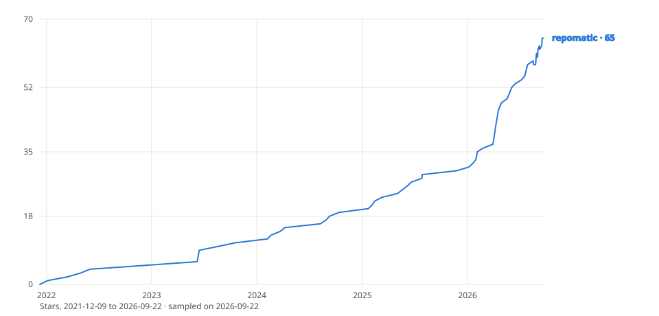

# {octicon}`log` History

Sampled weekly by [`repomatic sample-stars`](https://github.com/kdeldycke/repomatic/blob/main/repomatic/stars.py) into [`star-history.json`](assets/star-history.json), after GitHub restricted its stargazer endpoints to a repository's own admins in June 2026 and left every third-party chart rendering an error card. This curve is reconstructed from the timestamp of every star the repository still holds, so it runs back to 2021 rather than starting where sampling did, and it dips wherever a follower was lost.

The repository was [created on 9 December 2021](https://github.com/kdeldycke/repomatic/commit/5cbdbb95258f38e07d399a178378dece8b2a295c), two weeks after GitHub made [reusable workflows generally available](https://github.blog/changelog/2021-11-24-github-actions-reusable-workflows-are-generally-available/). The whole ambition fit in the first `readme.md`: "A central place where all my GitHub action workflows are defined." The first workflow linted YAML files, [the third commit](https://github.com/kdeldycke/repomatic/commit/46022625aa1f0ba031d03e08c75f574dc69e5682) added a Dependabot config, and `0.0.1` was tagged two days later.

## Everything was YAML

For the next two and a half years the project was workflow YAML, and the commit log records the friction. Poetry arrived on the first day to install the workflow's own dependencies and was [swapped for pip on the second](https://github.com/kdeldycke/repomatic/commit/eb6b17e7ec2e49b7d90225ff64a0b0ab71a3cc91). `sed` was [abandoned for Perl one-liners](https://github.com/kdeldycke/repomatic/commit/2a6e47a034ba35d13867d431907cc7089733add5) because the BSD and GNU variants disagree. A commit on skipping a workflow early concluded that ["there is no elegant way to exit early"](https://github.com/kdeldycke/repomatic/commit/95f2b81268acf7eb416d0e6a65e5b9da468eb7f9).

Consolidation started well before the CLI did. On 13 February 2023, pylint, pydocstyle, pycln, pyupgrade and isort were [each replaced by ruff](https://github.com/kdeldycke/repomatic/commit/dc8c68df61f53cc58eafdd85ba44f8bbf2f8622e) in a single day. `2.0.0` (December 2022) added Nuitka compilation of Python entry points into standalone binaries. `3.0.0` (February 2024) started swapping pip for uv, after [a first experiment](https://github.com/kdeldycke/repomatic/commit/15784fc286ae64e9ebbcb84dea98bb43ff79bec5) reverted the same day it landed.

## The single binary

In January 2024, a thread on `bump-my-version` asked for changelog updates to be automated as part of a version bump ([callowayproject/bump-my-version#124](https://github.com/callowayproject/bump-my-version/discussions/124)). None of the code below existed yet, but the reply left in that thread describes what the project turned into:

> I'm pretty sure there is a market for a single binary that automate all of this, like `ruff` did with linting and formatting. Or like `dependabot` did with dependency management. A highly configurable but fully integrated one-stop-shop to handle the release process (tagging, changelog update, binary compilation, distribution to package depots, version bumps, ...).
>
> The insight would be to rely as little as possible on GitHub actions. GHA should just be an entry point.

Five months later, [the first CLI skeleton](https://github.com/kdeldycke/repomatic/commit/9145c57ac46db397a8fa6df520cf7a1622e2b9d0) moved `metadata.py`, `update_changelog.py` and `update_mailmap.py` out of `.github/` and into a Python package. `4.0.0` (June 2024) shipped that package and dropped support for Poetry-based projects; `4.0.1` put it on PyPI as `gha-utils` the same day. The [CLI and its `pyproject.toml` configuration became the primary interface](https://github.com/kdeldycke/repomatic/commit/46efd60cc492d4ab106022d6486bf42a771be5dd) in February 2026, demoting the workflows to a delivery mechanism, and "GHA should just be an entry point" is now spelled out as a design principle in [`claude.md`](https://github.com/kdeldycke/repomatic/blob/main/claude.md).

The other half of that 2024 comment, replacing GitHub's leaky workflow model with something closer to a Petri net, remains unbuilt: the logic left the YAML, but the orchestration still rides on GitHub's job graph.

## Three names in one day

The package was `gha-utils` on PyPI and `kdeldycke/workflows` on GitHub until the scope outgrew both names. `6.0.0` renamed everything to `repokit` on 24 February 2026, and PyPI rejected the upload as typo-squatting the pre-existing [`repo-kit`](https://pypi.org/project/repo-kit/) package. `5.14.0` was yanked and `6.0.0` deleted from PyPI, `5.14.1` went out under the old `gha-utils` name with its metadata already pointed at the next one, and `repomatic` was picked and published before the day was over. Those releases are preserved with their warnings in the [changelog archive](changelog-archive.md).

## Back to where it started

Dependency management came full circle. The Dependabot config from the third commit was [replaced by Renovate](https://github.com/kdeldycke/repomatic/commit/046eec2723864430dddac8a19452e8fcb0cac8bb) in `5.0.0` (January 2026), and `7.0.0` (July 2026) removed Renovate too, in favor of `sync-deps` and its sibling updaters running as ordinary CLI commands. After four and a half years, the third-party bot that shipped before the first release is gone, and the repository updates itself.
