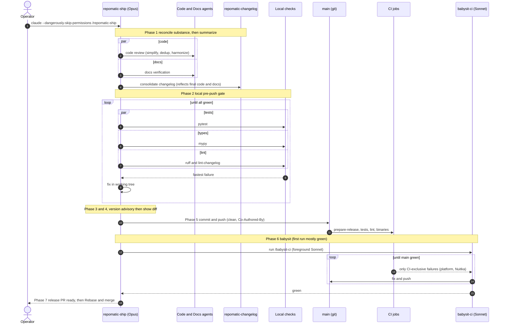

# {octicon}`mortar-board` Claude Code skills

This repository includes [Claude Code skills](https://docs.anthropic.com/en/docs/agents-and-tools/claude-code/skills) that bring `repomatic` workflows into Claude Code as slash commands. Downstream repositories can install them with:

```shell-session
$ uvx -- repomatic init skills
```

To install a single skill:

```shell-session
$ uvx -- repomatic init skills/repomatic-topics
```

Selectors use the same `component[/file]` syntax as the `exclude` config option in [`[tool.repomatic]`](configuration.md).

To list all available skills with descriptions:

```{click:run}
from repomatic.cli import repomatic
invoke(repomatic, args=['list-skills'])
```

## Available skills

| Phase       | Skill                                                                                                                  | Description                                                                                       |
| :---------- | :--------------------------------------------------------------------------------------------------------------------- | :------------------------------------------------------------------------------------------------ |
| Setup       | [`/repomatic-init`](https://github.com/kdeldycke/repomatic/blob/main/.claude/skills/repomatic-init/SKILL.md)           | Bootstrap a repository with reusable workflows                                                    |
| Development | [`/benchmark-update`](https://github.com/kdeldycke/repomatic/blob/main/.claude/skills/benchmark-update/SKILL.md)       | Create or update a competitive benchmark page comparing the project against alternatives          |
| Development | [`/brand-assets`](https://github.com/kdeldycke/repomatic/blob/main/.claude/skills/brand-assets/SKILL.md)               | Create and export project logo/banner SVG assets to light/dark PNG variants                       |
| Development | [`/repomatic-deps`](https://github.com/kdeldycke/repomatic/blob/main/.claude/skills/repomatic-deps/SKILL.md)           | Dependency graphs, declaration audit, and changelog-driven code modernization                     |
| Development | [`/repomatic-topics`](https://github.com/kdeldycke/repomatic/blob/main/.claude/skills/repomatic-topics/SKILL.md)       | Optimize GitHub topics for discoverability                                                        |
| Quality     | [`/babysit-ci`](https://github.com/kdeldycke/repomatic/blob/main/.claude/skills/babysit-ci/SKILL.md)                   | Monitor CI tests, lint, autofix, docs, and Nuitka binary builds until all stable jobs pass        |
| Maintenance | [`/awesome-triage`](https://github.com/kdeldycke/repomatic/blob/main/.claude/skills/awesome-triage/SKILL.md)           | Triage issues and PRs on awesome-list repos (awesome-list only)                                   |
| Maintenance | [`/file-bug-report`](https://github.com/kdeldycke/repomatic/blob/main/.claude/skills/file-bug-report/SKILL.md)         | Write a bug report for an upstream project                                                        |
| Maintenance | [`/repomatic-audit`](https://github.com/kdeldycke/repomatic/blob/main/.claude/skills/repomatic-audit/SKILL.md)         | Audit downstream repo alignment with upstream reference                                           |
| Maintenance | [`/sphinx-docs-sync`](https://github.com/kdeldycke/repomatic/blob/main/.claude/skills/sphinx-docs-sync/SKILL.md)       | Compare and sync Sphinx docs across sibling projects                                              |
| Maintenance | [`/translation-sync`](https://github.com/kdeldycke/repomatic/blob/main/.claude/skills/translation-sync/SKILL.md)       | Detect stale translations and draft updates (awesome-list only)                                   |
| Maintenance | [`/upstream-audit`](https://github.com/kdeldycke/repomatic/blob/main/.claude/skills/upstream-audit/SKILL.md)           | Create or update an upstream contributions page tracking the project's relationship with its deps |
| Release     | [`/av-false-positive`](https://github.com/kdeldycke/repomatic/blob/main/.claude/skills/av-false-positive/SKILL.md)     | Scan a release on VirusTotal and generate false positive submission instructions                  |
| Release     | [`/repomatic-changelog`](https://github.com/kdeldycke/repomatic/blob/main/.claude/skills/repomatic-changelog/SKILL.md) | Draft, validate, consolidate, and fix changelog entries                                           |
| Release     | [`/repomatic-ship`](https://github.com/kdeldycke/repomatic/blob/main/.claude/skills/repomatic-ship/SKILL.md)           | Orchestrate release prep: reconcile, commit, push, and babysit CI to a ready-to-merge release PR  |

## Recommended workflow

The typical lifecycle for maintaining a downstream repository follows this sequence. Each skill suggests next steps after completing, creating a guided flow:

1. `/repomatic-init` — One-time setup: bootstrap workflows, labels, and configs
2. `/repomatic-deps` — As needed: visualize the dependency tree
3. `/repomatic-changelog` — Before release: draft and validate changelog entries
4. `/repomatic-ship` — Release time: reconcile, commit, push, and babysit CI to a ready-to-merge release PR

## Walkthrough: setup to first release

These steps take a downstream repository from a fresh checkout to its first release, running each skill interactively and approving its actions as you go:

1. Bootstrap your repository (one-time) with [`/repomatic-init`](https://github.com/kdeldycke/repomatic/blob/main/.claude/skills/repomatic-init/SKILL.md):

   ```text
   /repomatic-init
   ```

2. Add changelog entries as you work, with [`/repomatic-changelog`](https://github.com/kdeldycke/repomatic/blob/main/.claude/skills/repomatic-changelog/SKILL.md):

   ```text
   /repomatic-changelog add
   ```

3. Hand the rest to [`/repomatic-ship`](https://github.com/kdeldycke/repomatic/blob/main/.claude/skills/repomatic-ship/SKILL.md): it reconciles the changelog, code, and docs, commits and pushes (rebuilding the [release PR](workflows.md#release-engineering)), then runs [`/babysit-ci`](https://github.com/kdeldycke/repomatic/blob/main/.claude/skills/babysit-ci/SKILL.md) until `main` is green, catching [Nuitka binary-build](#github-workflows-release-engine-yaml-jobs) breakage. It shows the changelog diff before the commit prompt, so you approve each step as you go:

   ```text
   /repomatic-ship
   ```

4. On GitHub, merge the release PR with ["Rebase and merge"](workflows.md#freeze-and-unfreeze-commits), never squash.

## Fully automated workflow

Step 3 of the [walkthrough](#walkthrough-setup-to-first-release) is the same skill whether you drive it or not. Under `--dangerously-skip-permissions`, [`/repomatic-ship`](https://github.com/kdeldycke/repomatic/blob/main/.claude/skills/repomatic-ship/SKILL.md) runs the whole release prep hands-off: reconcile, commit, push, and babysit CI until the release PR is green, pausing for nothing. In normal use the permission prompts are the review gate; skipping permissions removes them.

```shell-session
$ claude --dangerously-skip-permissions /repomatic-ship
```

```{warning}
`--dangerously-skip-permissions` disables *every* permission prompt for the session: Claude Code commits, pushes, and runs shell commands without asking first. Only use it when you trust the repository state, ideally inside a sandbox or disposable checkout.
```

The judgment-heavy sweep (changelog consolidation, the version read) runs on Opus, while the mechanical CI-fixing loop is delegated to a Sonnet subagent running [`/babysit-ci`](https://github.com/kdeldycke/repomatic/blob/main/.claude/skills/babysit-ci/SKILL.md). Its autonomous commits carry a `Co-Authored-By` trailer, and it stops at a green release PR: the final "Rebase and merge" stays yours.

The full sequence, with the parallel passes and the two convergence loops:


