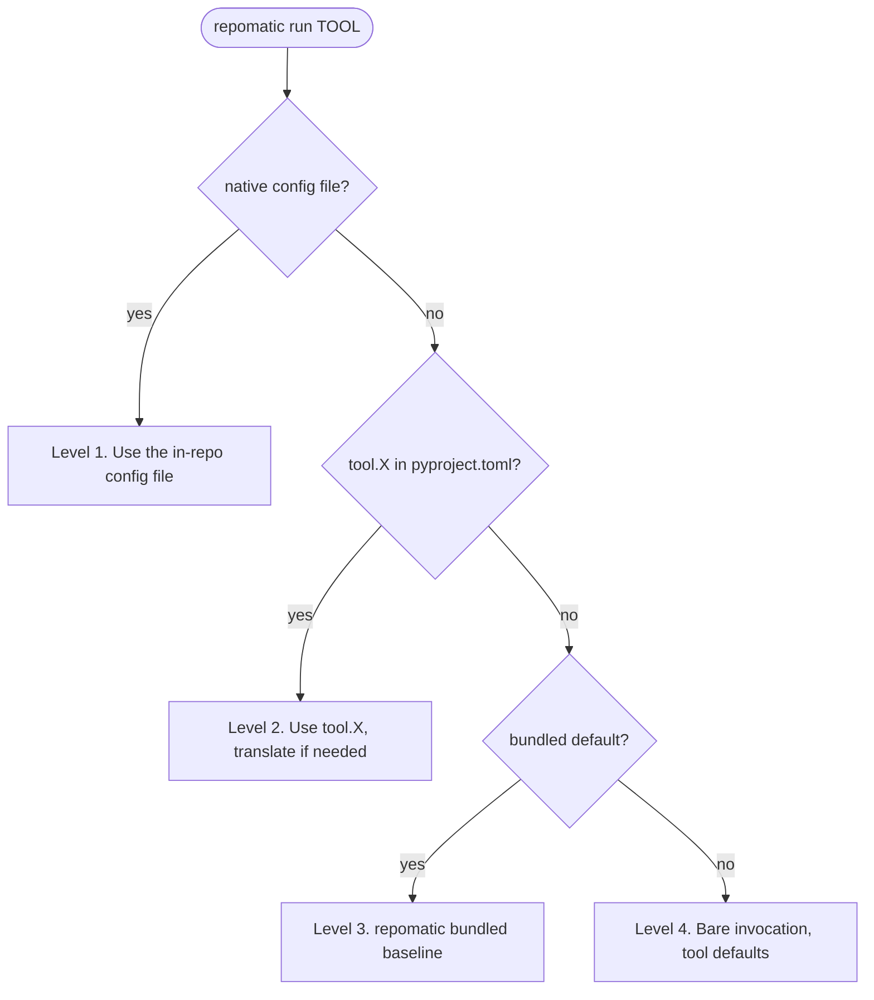

# {octicon}`tools` Tool runner

`repomatic run` is a unified entry point for running external linters, formatters, and security scanners. It installs each tool at a pinned version, resolves configuration through a strict precedence chain, and invokes the tool: no manual setup, no dotfile sprawl.

## Why not run the tools directly?

Installing a tool and running `yamllint .` yourself is fine for one tool on one machine. Once a project leans on a dozen, the same three chores repeat for each, and `repomatic run` takes care of all of them:

- Configuration stays in `pyproject.toml`, one reviewed file rather than a dotfile per tool. Even tools that can't read `pyproject.toml` themselves get their `[tool.X]` table translated to a temporary native config at run time, following the [precedence chain](#config-resolution) below.
- Installation is automatic: binaries come from GitHub Releases and are checksum-verified, PyPI tools run through `uvx`, and tools that import your code (mypy, Nuitka) run inside the project virtualenv.
- Versions are pinned and re-verified on each use, so a check behaves the same on your laptop and in CI instead of drifting with whatever each machine happens to have installed.

```{seealso}
The tools repomatic bridges have standing upstream requests to read `[tool.X]` from `pyproject.toml` natively, all still unshipped:
[actionlint#623](https://github.com/rhysd/actionlint/issues/623),
[biome#9239](https://github.com/biomejs/biome/discussions/9239),
[gitleaks#2066](https://github.com/gitleaks/gitleaks/issues/2066),
[Nuitka#3909](https://github.com/Nuitka/Nuitka/issues/3909),
[zizmor#322](https://github.com/orgs/zizmorcore/discussions/322#discussioncomment-15919620).
The same request for shfmt ([sh#1268](https://github.com/mvdan/sh/issues/1268)) was declined.
```

## Quick start

Run a tool against your project:

```shell-session
$ repomatic run yamllint -- .
```

The `--` separates repomatic's own options from the arguments forwarded to the tool. Everything after `--` is passed through verbatim.

List all managed tools and their resolved config source:

```{click:source}
:hide-source:
from repomatic.cli import repomatic
```

```{click:run}
invoke(repomatic, args=['run', '--list'])
```

## Available tools

<!-- tool-summary-start -->

| Tool                                                                  | Version  | Type        | Config discovery                                                               |
| :-------------------------------------------------------------------- | :------- | :---------- | :----------------------------------------------------------------------------- |
| [actionlint](https://github.com/rhysd/actionlint)                     | `1.7.12` | Binary      | `.github/actionlint.yaml`, `.github/actionlint.yml`                            |
| [autopep8](https://github.com/hhatto/autopep8)                        | `2.3.2`  | PyPI        | `[tool.autopep8]` in `pyproject.toml`                                          |
| [Biome](https://github.com/biomejs/biome)                             | `2.5.0`  | Binary      | `biome.json`, `biome.jsonc`, `.biome.json`, `.biome.jsonc`                     |
| [bump-my-version](https://github.com/callowayproject/bump-my-version) | `1.2.7`  | PyPI        | `.bumpversion.toml`, `[tool.bump-my-version]` in `pyproject.toml`              |
| [Gitleaks](https://github.com/gitleaks/gitleaks)                      | `8.30.1` | Binary      | `.gitleaks.toml`                                                               |
| [labelmaker](https://github.com/jwodder/labelmaker)                   | `0.6.4`  | Binary      | CLI flags only                                                                 |
| [Lychee](https://github.com/lycheeverse/lychee)                       | `0.24.2` | Binary      | `lychee.toml`, `[tool.lychee]` in `pyproject.toml`                             |
| [mdformat](https://github.com/hukkin/mdformat)                        | `1.0.0`  | PyPI        | `.mdformat.toml`, `[tool.mdformat]` in `pyproject.toml`                        |
| [mypy](https://github.com/python/mypy)                                | `1.19.1` | PyPI (venv) | `[tool.mypy]` in `pyproject.toml`                                              |
| [Nuitka](https://github.com/Nuitka/Nuitka)                            | `4.1`    | PyPI (venv) | `[tool.nuitka]` in `pyproject.toml`                                            |
| [pyproject-fmt](https://github.com/tox-dev/pyproject-fmt)             | `2.25.0` | PyPI        | `pyproject-fmt.toml`, `[tool.pyproject-fmt]` in `pyproject.toml`               |
| [Ruff](https://github.com/astral-sh/ruff)                             | `0.15.5` | PyPI        | `.ruff.toml`, `ruff.toml`, `[tool.ruff]` in `pyproject.toml`                   |
| [shfmt](https://github.com/mvdan/sh)                                  | `3.13.1` | Binary      | `.editorconfig`                                                                |
| [typos](https://github.com/crate-ci/typos)                            | `1.47.2` | Binary      | `typos.toml`, `_typos.toml`, `.typos.toml`, `[tool.typos]` in `pyproject.toml` |
| [yamllint](https://github.com/adrienverge/yamllint)                   | `1.38.0` | PyPI        | `.yamllint`, `.yamllint.yaml`, `.yamllint.yml`                                 |
| [zizmor](https://github.com/zizmorcore/zizmor)                        | `1.23.0` | PyPI        | `.github/zizmor.yml`, `.github/zizmor.yaml`, `zizmor.yml`, `zizmor.yaml`       |

<!-- tool-summary-end -->

- **Binary**: downloaded as platform-specific executables from GitHub Releases.
- **PyPI**: installed via `uvx`.
- **PyPI (venv)**: run inside the project virtualenv via `uv run` because they need to import project code.

## Config resolution

When `repomatic run <tool>` is invoked, configuration is resolved through a 4-level precedence chain. The first match wins: no merging across levels.



> [!TIP]
> Run `repomatic --verbosity INFO run <tool>` to see which config level was selected and the exact command line being executed. This is useful for debugging unexpected behavior. For full detail (config file contents, environment, caching), use `--verbosity DEBUG`.

### Level 1: native config file

If the tool's own config file exists in the repo (like `ruff.toml` or `.yamllint.yaml`), repomatic defers to it entirely. Your repo stays in control.

```shell-session
$ ls ruff.toml
ruff.toml
$ repomatic run ruff -- check .
# Uses ruff.toml directly — repomatic does nothing special.
```

### Level 2: `[tool.X]` in `pyproject.toml`

If no native config file is found but your `pyproject.toml` has a `[tool.<name>]` section, repomatic uses it. For tools that read `pyproject.toml` natively (ruff, mypy, bump-my-version, etc.), this just works. For tools that don't, repomatic translates the section into the tool's native format and passes it via a temporary config file.

```{note}
When the tool's native format is also TOML (like gitleaks), the translation keeps the comments from your `[tool.X]` section and only drops the `[tool.X]` prefix. Translations to another format (YAML, JSON) carry the values only: a TOML comment has no equivalent to map onto.
```

```toml
# pyproject.toml
[tool.yamllint.rules.line-length]
max = 120

[tool.yamllint.rules.truthy]
check-keys = false
```

```shell-session
$ repomatic run yamllint -- .
# Translates [tool.yamllint] to YAML, passes via --config-file.
```

All tools that support `[tool.X]` sections in `pyproject.toml`, whether natively or via repomatic's translation bridge:

| Tool                                                                                | Customizes                          | Section                                                                                              | Support                                                                                                               |
| :---------------------------------------------------------------------------------- | :---------------------------------- | :--------------------------------------------------------------------------------------------------- | :-------------------------------------------------------------------------------------------------------------------- |
| [actionlint](https://github.com/rhysd/actionlint)                                   | Workflow linting rules              | [`[tool.actionlint]`](https://kdeldycke.github.io/click-extra/config.html#pyproject-toml)            | [repomatic bridge](https://kdeldycke.github.io/click-extra/config.html#pyproject-toml) → YAML                         |
| [autopep8](https://github.com/hhatto/autopep8)                                      | Python code formatting              | [`[tool.autopep8]`](https://pypi.org/project/autopep8/)                                              | Native                                                                                                                |
| [biome](https://biomejs.dev)                                                        | JSON/JS formatting and linting      | [`[tool.biome]`](https://kdeldycke.github.io/click-extra/config.html#pyproject-toml)                 | [repomatic bridge](https://kdeldycke.github.io/click-extra/config.html#pyproject-toml) → JSON                         |
| [bump-my-version](https://callowayproject.github.io/bump-my-version/)               | Version bump patterns and files     | [`[tool.bumpversion]`](https://callowayproject.github.io/bump-my-version/reference/configuration/)   | Native                                                                                                                |
| [coverage.py](https://coverage.readthedocs.io/en/latest/config.html)                | Code coverage reporting             | [`[tool.coverage.*]`](https://coverage.readthedocs.io/en/latest/config.html#configuration-reference) | Native                                                                                                                |
| [gitleaks](https://github.com/gitleaks/gitleaks)                                    | Secret detection rules              | [`[tool.gitleaks]`](https://kdeldycke.github.io/click-extra/config.html#pyproject-toml)              | [repomatic bridge](https://kdeldycke.github.io/click-extra/config.html#pyproject-toml) → TOML                         |
| [lychee](https://lychee.cli.rs)                                                     | Link checking rules                 | [`[tool.lychee]`](https://lychee.cli.rs/guides/config/)                                              | Native                                                                                                                |
| [mdformat](https://mdformat.readthedocs.io/en/stable/users/configuration_file.html) | Markdown formatting options         | [`[tool.mdformat]`](https://mdformat.readthedocs.io/en/stable/users/configuration_file.html)         | Native (via [`mdformat-pyproject`](https://github.com/csala/mdformat-pyproject))                                      |
| [mypy](https://mypy.readthedocs.io/en/stable/config_file.html)                      | Static type checking                | [`[tool.mypy]`](https://mypy.readthedocs.io/en/stable/config_file.html#using-a-pyproject-toml-file)  | Native                                                                                                                |
| [nuitka](https://github.com/Nuitka/Nuitka)                                          | Standalone binary compilation       | [`[tool.nuitka]`](https://nuitka.net/doc/user-manual.html)                                           | [repomatic bridge](#nuitka) → CLI flags ([native support: Nuitka#3909](https://github.com/Nuitka/Nuitka/issues/3909)) |
| [pyproject-fmt](https://pyproject-fmt.readthedocs.io/en/latest/)                    | `pyproject.toml` formatting         | [`[tool.pyproject-fmt]`](https://pyproject-fmt.readthedocs.io/en/latest/)                            | Native                                                                                                                |
| [pytest](https://docs.pytest.org/en/stable/reference/customize.html)                | Test runner options                 | [`[tool.pytest]`](https://docs.pytest.org/en/stable/reference/customize.html#pyproject-toml)         | Native                                                                                                                |
| [ruff](https://docs.astral.sh/ruff/configuration/)                                  | Linting and formatting rules        | [`[tool.ruff]`](https://docs.astral.sh/ruff/configuration/#configuring-ruff)                         | Native                                                                                                                |
| [typos](https://github.com/crate-ci/typos)                                          | Spell-checking exceptions           | [`[tool.typos]`](https://github.com/crate-ci/typos/blob/master/docs/reference.md)                    | Native                                                                                                                |
| [uv](https://docs.astral.sh/uv/reference/settings/)                                 | Package resolution and build config | [`[tool.uv]`](https://docs.astral.sh/uv/reference/settings/)                                         | Native                                                                                                                |
| [yamllint](https://yamllint.readthedocs.io)                                         | YAML linting rules                  | [`[tool.yamllint]`](https://kdeldycke.github.io/click-extra/config.html#pyproject-toml)              | [repomatic bridge](https://kdeldycke.github.io/click-extra/config.html#pyproject-toml) → YAML                         |
| [zizmor](https://docs.zizmor.sh)                                                    | Workflow security scanning          | [`[tool.zizmor]`](https://kdeldycke.github.io/click-extra/config.html#pyproject-toml)                | [repomatic bridge](https://kdeldycke.github.io/click-extra/config.html#pyproject-toml) → YAML                         |

See [Click Extra's inventory of `pyproject.toml`-aware tools](https://kdeldycke.github.io/click-extra/config.html#pyproject-toml) for a broader list.

### Level 3: bundled default

If the repo has no config at all, repomatic falls back to its own bundled defaults (stored in `repomatic/data/`). These provide sensible baseline rules so that tools produce useful results even without any project-specific configuration.

Tools with bundled defaults: mdformat, ruff, yamllint, zizmor.

### Level 4: bare invocation

If none of the above applies (no config file, no `[tool.X]`, no bundled default), the tool runs with its own built-in defaults. Tools like autopep8 work this way: all behavior is controlled through CLI flags.

### Checking the active config source

To see which precedence level is active for each tool in your repo:

```{click:run}
invoke(repomatic, args=['run', '--list'])
```

The "Config source" column shows whether the tool is using a native config file (level 1), `[tool.X]` (level 2), a bundled default (level 3), or bare invocation (level 4).

## Tutorial: adding yamllint to your project

This walkthrough covers a common scenario: running yamllint on a project that has no YAML linting configured.

### Step 1: run with defaults

With no config file and no `[tool.yamllint]` section in `pyproject.toml`, repomatic uses its bundled default:

```shell-session
$ repomatic run yamllint -- .
```

The bundled config enforces strict YAML rules. If that produces too many warnings, customize it.

### Step 2: customize via `pyproject.toml`

Instead of creating a `.yamllint.yaml` file, add a section to your `pyproject.toml`:

```toml
[tool.yamllint.rules.line-length]
max = 120

[tool.yamllint.rules.truthy]
check-keys = false
```

Now `repomatic run yamllint -- .` translates this to YAML, passes it via `--config-file`, and cleans up the temporary file afterward.

### Step 3: graduate to a native config file

If your yamllint config grows complex, create a `.yamllint.yaml` directly. Once that file exists, repomatic defers to it (level 1 takes precedence) and the `[tool.yamllint]` section in `pyproject.toml` is ignored.

### Cleaning up unmodified configs

If you previously ran `repomatic init` and have a native config file that is identical to the bundled default, `repomatic init --delete-unmodified` removes it:

```shell-session
$ repomatic init --delete-unmodified
```

## Overriding tool versions

To test a newer version of a tool before the registry is updated:

```shell-session
$ repomatic run shfmt --version 3.14.0 --skip-checksum -- .
```

`--skip-checksum` is required because the registry only stores checksums for the pinned version. For binary tools, `--checksum` lets you provide the correct SHA-256 for the new version instead of skipping verification entirely:

```shell-session
$ repomatic run shfmt --version 3.14.0 --checksum abc123... -- .
```

## Binary caching

`repomatic run` downloads platform-specific binaries (actionlint, biome, gitleaks, labelmaker, lychee, etc.) from GitHub Releases. To avoid re-downloading on every invocation, binaries are cached under a platform-appropriate user cache directory:

| Platform | Default cache path                                  |
| :------- | :-------------------------------------------------- |
| Linux    | `$XDG_CACHE_HOME/repomatic` or `~/.cache/repomatic` |
| macOS    | `~/Library/Caches/repomatic`                        |
| Windows  | `%LOCALAPPDATA%\repomatic\Cache`                    |

Cached binaries are re-verified against their registry SHA-256 checksum on every use. Entries older than 30 days are auto-purged.

Both settings are configurable via `[tool.repomatic]` (see [`cache.dir`](configuration.md#cache-dir) and [`cache.max-age`](configuration.md#cache-max-age)) or environment variables. The env var takes precedence over the config.

| Environment variable      | Config key                                        | Default               | Description                                                 |
| :------------------------ | :------------------------------------------------ | :-------------------- | :---------------------------------------------------------- |
| `REPOMATIC_CACHE_DIR`     | [`cache.dir`](configuration.md#cache-dir)         | *(platform-specific)* | Override the cache directory path.                          |
| `REPOMATIC_CACHE_MAX_AGE` | [`cache.max-age`](configuration.md#cache-max-age) | `30`                  | Auto-purge entries older than this many days. `0` disables. |

Cache management commands:

```shell-session
$ repomatic cache show
$ repomatic cache clean
$ repomatic cache clean --tool ruff --max-age 7
$ repomatic cache path
```

Use `--no-cache` on `repomatic run` to bypass the cache entirely.

## Passing extra arguments

Everything after `--` is forwarded to the tool:

```shell-session
$ repomatic run ruff -- check --fix .
$ repomatic run zizmor -- --offline .github/workflows/
$ repomatic run biome -- format --write src/
```

For tools with subcommands (ruff, biome, gitleaks), the subcommand goes after `--` as the first argument.

## Tool details

<!-- tool-reference-start -->

### [actionlint](https://github.com/rhysd/actionlint)

**Installed version:** `1.7.12`

**Installation method:** Binary (downloaded from GitHub Releases)

**Config files:** `.github/actionlint.yaml`, `.github/actionlint.yml`

**`[tool.actionlint]` bridge:** repomatic translates to YAML and passes via `--config-file`.

**Default flags:** `-color`

[Source](https://github.com/rhysd/actionlint) | [Config reference](https://github.com/rhysd/actionlint/blob/main/docs/config.md) | [CLI usage](https://github.com/rhysd/actionlint/blob/main/docs/usage.md)

<!-- actionlint-manual-start -->

**Try it:**

```shell-session
$ repomatic run actionlint
```

**Minimal `[tool.actionlint]`:**

```toml
[tool.actionlint.self-hosted-runner]
labels = ["my-linux-runner"]
```

With no arguments actionlint lints every workflow under `.github/workflows`. The `[tool.actionlint]` section is bridged to a temporary YAML config: declaring self-hosted runner labels stops custom `runs-on:` values being flagged as unknown.

<!-- actionlint-manual-end -->

### [autopep8](https://github.com/hhatto/autopep8)

**Installed version:** `2.3.2`

**Installation method:** PyPI, installed via `uvx`

**Config:** `[tool.autopep8]` in `pyproject.toml` (native)

**Default flags:** `--recursive` `--in-place` `--max-line-length` `88` `--select` `E501`

[Source](https://github.com/hhatto/autopep8) | [CLI usage](https://pypi.org/project/autopep8/)

<!-- autopep8-manual-start -->

**Try it:**

```shell-session
$ repomatic run autopep8 -- .
```

autopep8 takes its configuration from CLI flags only. repomatic passes `--recursive --in-place --max-line-length 88 --select E501` by default; append more flags after `--`.

<!-- autopep8-manual-end -->

### [Biome](https://github.com/biomejs/biome)

**Installed version:** `2.5.0`

**Installation method:** Binary (downloaded from GitHub Releases)

**Config files:** `biome.json`, `biome.jsonc`, `.biome.json`, `.biome.jsonc`

**`[tool.biome]` bridge:** repomatic translates to JSON and passes via `--config-path`.

[Source](https://github.com/biomejs/biome) | [Config reference](https://biomejs.dev/reference/configuration/) | [CLI usage](https://biomejs.dev/reference/cli/)

<!-- biome-manual-start -->

**Try it:**

```shell-session
$ repomatic run biome -- check .
```

**Minimal `[tool.biome]`:**

```toml
[tool.biome.formatter]
indentStyle = "space"
```

`biome check` reports formatting and lint issues; add `--write` after `--` to apply fixes. The `[tool.biome]` section is bridged to a temporary `biome.json`, so keys keep Biome's camelCase spelling.

<!-- biome-manual-end -->

### [bump-my-version](https://github.com/callowayproject/bump-my-version)

**Installed version:** `1.2.7`

**Installation method:** PyPI, installed via `uvx`

**Config files:** `.bumpversion.toml` and `[tool.bump-my-version]` in `pyproject.toml` (native)

[Source](https://github.com/callowayproject/bump-my-version) | [Config reference](https://callowayproject.github.io/bump-my-version/reference/configuration/) | [CLI usage](https://callowayproject.github.io/bump-my-version/reference/cli/)

<!-- bump-my-version-manual-start -->

**Try it:**

```shell-session
$ repomatic run bump-my-version -- show-bump
```

**Minimal `[tool.bumpversion]`:**

```toml
[tool.bumpversion]
current_version = "1.2.3"
```

The configuration table is `[tool.bumpversion]`, not `[tool.bump-my-version]`: the section name predates the project's rename. `show-bump` previews the next versions without writing; `repomatic run bump-my-version -- bump minor` performs the bump.

<!-- bump-my-version-manual-end -->

### [Gitleaks](https://github.com/gitleaks/gitleaks)

**Installed version:** `8.30.1`

**Installation method:** Binary (downloaded from GitHub Releases)

**Config files:** `.gitleaks.toml`

**`[tool.gitleaks]` bridge:** repomatic translates to TOML and passes via `--config`.

[Source](https://github.com/gitleaks/gitleaks) | [Config reference](https://github.com/gitleaks/gitleaks#configuration) | [CLI usage](https://github.com/gitleaks/gitleaks#usage)

<!-- gitleaks-manual-start -->

**Try it:**

```shell-session
$ repomatic run gitleaks -- dir .
```

**Minimal `[tool.gitleaks]`:**

```toml
[tool.gitleaks.extend]
useDefault = true

[tool.gitleaks.allowlist]
paths = ['''\.env\.sample$''']
```

`gitleaks dir .` scans the working tree; `gitleaks git` scans history instead. The `[tool.gitleaks]` section is bridged to a temporary `.gitleaks.toml`: keep `extend.useDefault = true`, or a custom config silently replaces the built-in rule set.

<!-- gitleaks-manual-end -->

### [labelmaker](https://github.com/jwodder/labelmaker)

**Installed version:** `0.6.4`

**Installation method:** Binary (downloaded from GitHub Releases)

**Config:** CLI flags only

[Source](https://github.com/jwodder/labelmaker) | [CLI usage](https://github.com/jwodder/labelmaker)

<!-- labelmaker-manual-start -->

labelmaker syncs a repository's issue and PR labels from a label-definition file, so unlike the linters it needs a target repository and a `GITHUB_TOKEN`, not a path in the working tree. There is no `[tool.labelmaker]` section: the label file is the configuration. See the [upstream usage docs](https://github.com/jwodder/labelmaker) for its flags and file schema.

<!-- labelmaker-manual-end -->

### [Lychee](https://github.com/lycheeverse/lychee)

**Installed version:** `0.24.2`

**Installation method:** Binary (downloaded from GitHub Releases)

**Config files:** `lychee.toml` and `[tool.lychee]` in `pyproject.toml` (native)

[Source](https://github.com/lycheeverse/lychee) | [Config reference](https://lychee.cli.rs/guides/config/) | [CLI usage](https://lychee.cli.rs/guides/cli/)

<!-- lychee-manual-start -->

**Try it:**

```shell-session
$ repomatic run lychee -- .
```

**Minimal `[tool.lychee]`:**

```toml
[tool.lychee]
max_redirects = 5
```

lychee checks links found in the given path. Since v0.24 it reads `[tool.lychee]` from `pyproject.toml` natively, so repomatic does not translate it.

<!-- lychee-manual-end -->

### [mdformat](https://github.com/hukkin/mdformat)

**Installed version:** `1.0.0`

**Installation method:** PyPI, installed via `uvx`

**Config files:** `.mdformat.toml` and `[tool.mdformat]` in `pyproject.toml` (native)

**Default flags:** `--strict-front-matter`

**Bundled default:** [`mdformat.toml`](https://github.com/kdeldycke/repomatic/blob/main/repomatic/data/mdformat.toml)

**Plugins:**

- `mdformat_admon`
- `mdformat-config`
- `mdformat_deflist`
- `mdformat_footnote`
- `mdformat-front-matters`
- `mdformat-gfm`
- `mdformat_gfm_alerts`
- `mdformat_myst`
- `mdformat-pelican`
- `mdformat_pyproject`
- `mdformat-recover-urls`
- `mdformat-ruff`
- `mdformat-shfmt`
- `mdformat_simple_breaks`
- `mdformat-toc`
- `mdformat-web`
- `ruff`

[Source](https://github.com/hukkin/mdformat) | [Config reference](https://mdformat.readthedocs.io/en/stable/users/configuration_file.html) | [CLI usage](https://mdformat.readthedocs.io/en/stable/users/installation_and_usage.html)

<!-- mdformat-manual-start -->

**Try it:**

```shell-session
$ repomatic run mdformat -- .
```

**Minimal `[tool.mdformat]`:**

```toml
[tool.mdformat]
wrap = "no"
```

mdformat rewrites Markdown in place. repomatic bundles a plugin set (GFM, MyST, front-matter, and others) and a baseline `mdformat.toml`; `[tool.mdformat]` in your `pyproject.toml` overrides it.

<!-- mdformat-manual-end -->

### [mypy](https://github.com/python/mypy)

**Installed version:** `1.19.1`

**Installation method:** PyPI, runs in project virtualenv via `uv run`

**Config:** `[tool.mypy]` in `pyproject.toml` (native)

**Default flags:** `--color-output`

[Source](https://github.com/python/mypy) | [Config reference](https://mypy.readthedocs.io/en/stable/config_file.html) | [CLI usage](https://mypy.readthedocs.io/en/stable/command_line.html)

<!-- mypy-manual-start -->

**Try it:**

```shell-session
$ repomatic run mypy -- .
```

**Minimal `[tool.mypy]`:**

```toml
[tool.mypy]
strict = true
```

mypy runs inside the project virtualenv (via `uv run`) so it can import your dependencies. repomatic derives `--python-version` from `requires-python`, so the check matches your lowest supported interpreter.

<!-- mypy-manual-end -->

### [Nuitka](https://github.com/Nuitka/Nuitka)

**Installed version:** `4.1`

**Installation method:** PyPI, runs in project virtualenv via `uv run`

**Config:** `[tool.nuitka]` in `pyproject.toml` (translated to CLI flags)

**Default flags:** `--mode=onefile` `--assume-yes-for-downloads`

[Source](https://github.com/Nuitka/Nuitka) | [Config reference](https://nuitka.net/doc/user-manual.html) | [CLI usage](https://nuitka.net/doc/user-manual.html)

<!-- nuitka-manual-start -->

**Try it:**

```shell-session
$ repomatic run nuitka -- my_app/__main__.py
```

**Minimal `[tool.nuitka]`:**

```toml
[tool.nuitka]
onefile = true
output-dir = "build"
```

repomatic reads every key from `[tool.nuitka]` and forwards it as a CLI flag: `true` becomes a bare `--flag`, a string or number becomes `--key=value`, and a list repeats the flag once per item. Nuitka does not read `[tool.nuitka]` natively yet ([Nuitka#3909](https://github.com/Nuitka/Nuitka/issues/3909)); repomatic's bridge fills the gap until it does.

<!-- nuitka-manual-end -->

### [pyproject-fmt](https://github.com/tox-dev/pyproject-fmt)

**Installed version:** `2.25.0`

**Installation method:** PyPI, installed via `uvx`

**Config files:** `pyproject-fmt.toml` and `[tool.pyproject-fmt]` in `pyproject.toml` (native)

[Source](https://github.com/tox-dev/pyproject-fmt) | [Config reference](https://pyproject-fmt.readthedocs.io/en/latest/) | [CLI usage](https://pyproject-fmt.readthedocs.io/en/latest/)

<!-- pyproject-fmt-manual-start -->

**Try it:**

```shell-session
$ repomatic run pyproject-fmt -- pyproject.toml
```

**Minimal `[tool.pyproject-fmt]`:**

```toml
[tool.pyproject-fmt]
indent = 4
```

pyproject-fmt normalizes and reorders `pyproject.toml` in place. It reads its own `[tool.pyproject-fmt]` section natively.

<!-- pyproject-fmt-manual-end -->

### [Ruff](https://github.com/astral-sh/ruff)

**Installed version:** `0.15.5`

**Installation method:** PyPI, installed via `uvx`

**Config files:** `.ruff.toml`, `ruff.toml` and `[tool.ruff]` in `pyproject.toml` (native)

**Bundled default:** [`ruff.toml`](https://github.com/kdeldycke/repomatic/blob/main/repomatic/data/ruff.toml)

[Source](https://github.com/astral-sh/ruff) | [Config reference](https://docs.astral.sh/ruff/configuration/) | [CLI usage](https://docs.astral.sh/ruff/configuration/#command-line-interface)

<!-- ruff-manual-start -->

**Try it:**

```shell-session
$ repomatic run ruff -- check .
```

**Minimal `[tool.ruff]`:**

```toml
[tool.ruff]
line-length = 100
```

`ruff check .` lints; `ruff format .` reformats. Both read `[tool.ruff]` natively. With no project config, repomatic falls back to its bundled `ruff.toml` baseline.

<!-- ruff-manual-end -->

### [shfmt](https://github.com/mvdan/sh)

**Installed version:** `3.13.1`

**Installation method:** Binary (downloaded from GitHub Releases)

**Config files:** `.editorconfig`

**Default flags:** `--write`

[Source](https://github.com/mvdan/sh) | [Config reference](https://github.com/mvdan/sh/blob/master/cmd/shfmt/shfmt.1.scd) | [CLI usage](https://github.com/mvdan/sh#shfmt)

<!-- shfmt-manual-start -->

**Try it:**

```shell-session
$ repomatic run shfmt -- .
```

shfmt formats shell scripts in place. It has no `[tool.shfmt]` section: indentation and style come from `.editorconfig` (`indent_size`, `shell_variant`, and the `shfmt`-specific keys).

<!-- shfmt-manual-end -->

### [typos](https://github.com/crate-ci/typos)

**Installed version:** `1.47.2`

**Installation method:** Binary (downloaded from GitHub Releases)

**Config files:** `typos.toml`, `_typos.toml`, `.typos.toml` and `[tool.typos]` in `pyproject.toml` (native)

**Default flags:** `--write-changes`

[Source](https://github.com/crate-ci/typos) | [Config reference](https://github.com/crate-ci/typos/blob/master/docs/reference.md) | [CLI usage](https://github.com/crate-ci/typos/blob/master/docs/reference.md)

<!-- typos-manual-start -->

**Try it:**

```shell-session
$ repomatic run typos -- .
```

**Minimal `[tool.typos]`:**

```toml
[tool.typos.files]
extend-exclude = ["*.lock"]
```

typos scans the tree and, with repomatic's default `--write-changes`, fixes what it finds. It reads `[tool.typos]` natively; use `[tool.typos.default.extend-words]` to map project-specific terms to their intended spelling.

<!-- typos-manual-end -->

### [yamllint](https://github.com/adrienverge/yamllint)

**Installed version:** `1.38.0`

**Installation method:** PyPI, installed via `uvx`

**Config files:** `.yamllint`, `.yamllint.yaml`, `.yamllint.yml`

**`[tool.yamllint]` bridge:** repomatic translates to YAML and passes via `--config-file`.

**Default flags:** `--strict`

**CI flags:** `--format` `github`

**Bundled default:** [`yamllint.yaml`](https://github.com/kdeldycke/repomatic/blob/main/repomatic/data/yamllint.yaml)

[Source](https://github.com/adrienverge/yamllint) | [Config reference](https://yamllint.readthedocs.io/en/stable/configuration.html) | [CLI usage](https://yamllint.readthedocs.io/en/stable/quickstart.html)

<!-- yamllint-manual-start -->

**Try it:**

```shell-session
$ repomatic run yamllint -- .
```

**Minimal `[tool.yamllint]`:**

```toml
[tool.yamllint.rules.line-length]
max = 120
```

yamllint has no native `pyproject.toml` support, so repomatic bridges `[tool.yamllint]` to a temporary YAML config passed via `--config-file`. With no project config it uses repomatic's strict bundled `yamllint.yaml`.

<!-- yamllint-manual-end -->

### [zizmor](https://github.com/zizmorcore/zizmor)

**Installed version:** `1.23.0`

**Installation method:** PyPI, installed via `uvx`

**Config files:** `.github/zizmor.yml`, `.github/zizmor.yaml`, `zizmor.yml`, `zizmor.yaml`

**`[tool.zizmor]` bridge:** repomatic translates to YAML and passes via `--config`.

**Default flags:** `--offline`

**CI flags:** `--format` `github`

**Bundled default:** [`zizmor.yaml`](https://github.com/kdeldycke/repomatic/blob/main/repomatic/data/zizmor.yaml)

[Source](https://github.com/zizmorcore/zizmor) | [Config reference](https://docs.zizmor.sh/configuration/) | [CLI usage](https://docs.zizmor.sh/usage/)

<!-- zizmor-manual-start -->

**Try it:**

```shell-session
$ repomatic run zizmor -- .
```

zizmor audits GitHub Actions workflows for security issues, offline by default. repomatic bridges `[tool.zizmor]` to a temporary YAML config (passed via `--config`); with none, it uses the bundled `zizmor.yaml`. See the [configuration reference](https://docs.zizmor.sh/configuration/) for available keys.

<!-- zizmor-manual-end -->

## Comparison

| Tool                                |                                                                                                     Stars |                                                      Last release                                                       |                                                      Last commit                                                      |                                                                                                                 Commits |                                                      Dependencies                                                      |                                                  Language                                                  |                                                    License                                                    |
| :---------------------------------- | --------------------------------------------------------------------------------------------------------: | :---------------------------------------------------------------------------------------------------------------------: | :-------------------------------------------------------------------------------------------------------------------: | ----------------------------------------------------------------------------------------------------------------------: | :--------------------------------------------------------------------------------------------------------------------: | :--------------------------------------------------------------------------------------------------------: | :-----------------------------------------------------------------------------------------------------------: |
| [actionlint](#actionlint)           |                 |                 |                 |                 |                 |                 |                 |
| [autopep8](#autopep8)               |                  |                  |                  |                  |                  |                  |                  |
| [Biome](#biome)                     |                    |                    |                    |                    |                    |                    |                    |
| [bump-my-version](#bump-my-version) |  |  |  |  |  |  |  |
| [Gitleaks](#gitleaks)               |                |                |                |                |                |                |                |
| [labelmaker](#labelmaker)           |               |               |               |               |               |               |               |
| [Lychee](#lychee)                   |               |               |               |               |               |               |               |
| [mdformat](#mdformat)               |                  |                                      |                  |                  |                  |                  |                  |
| [mypy](#mypy)                       |                      |                                          |                      |                      |                      |                      |                      |
| [Nuitka](#nuitka)                   |                    |                    |                    |                    |                    |                    |                    |
| [pyproject-fmt](#pyproject-fmt)     |            |            |            |            |            |            |            |
| [Ruff](#ruff)                       |                   |                   |                   |                   |                   |                   |                   |
| [shfmt](#shfmt)                     |                         |                         |                         |                         |                         |                         |                         |
| [typos](#typos)                     |                   |                   |                   |                   |                   |                   |                   |
| [yamllint](#yamllint)               |             |             |             |             |             |             |             |
| [zizmor](#zizmor)                   |                |                |                |                |                |                |                |

<!-- tool-reference-end -->

## `repomatic.tool_runner` API

```{eval-rst}
.. autoclasstree:: repomatic.tool_runner
   :strict:

.. automodule:: repomatic.tool_runner
   :members:
   :undoc-members:
   :show-inheritance:
```
