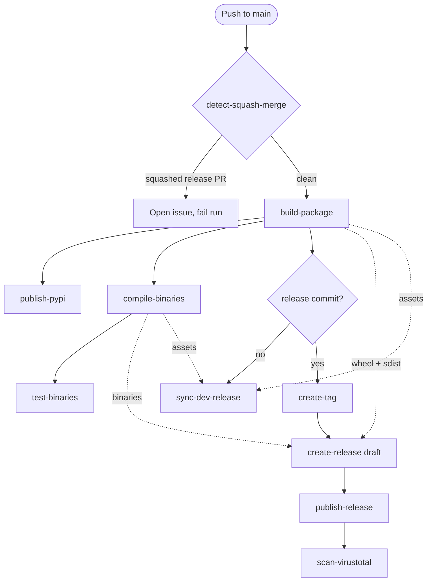
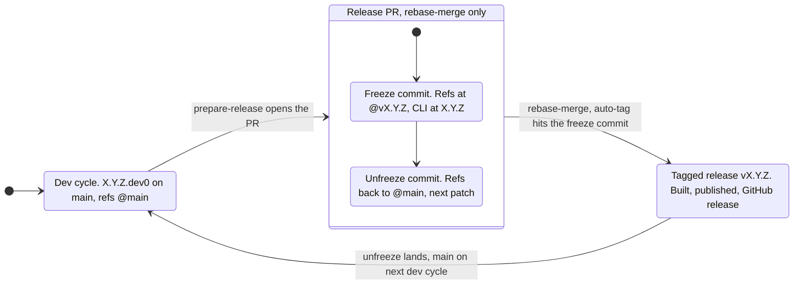

# {octicon}`workflow` Reusable workflows

The `repomatic` CLI operates in CI through [reusable GitHub Actions workflows](https://docs.github.com/en/actions/how-tos/reuse-automations/reuse-workflows). You configure behavior via [`[tool.repomatic]`](configuration.md) in `pyproject.toml`; the workflows are the execution layer.

### Example usage

The fastest way to adopt these workflows is with `repomatic init` (see [Quick start](install.md#quick-start)). It generates all the thin-caller workflow files for you.

If you prefer to set up a single workflow manually, create a `.github/workflows/lint.yaml` file [using the `uses` syntax](https://docs.github.com/en/actions/how-tos/reuse-automations/reuse-workflows#calling-a-reusable-workflow):

```yaml
name: Lint
on:
  push:
  pull_request:

jobs:
  lint:
    uses: kdeldycke/repomatic/.github/workflows/lint.yaml@v6.28.0
```

> [!IMPORTANT]
> [Concurrency is already configured](security.md#concurrency-and-cancellation) in the reusable workflows—you don't need to re-specify it in your calling workflow.

### GitHub Actions limitations

GitHub Actions has several design limitations that the workflows work around:

| Limitation                                                                                                                                                                       | Status             | Addressed by                                                                                                                                                                                                                            |
| :------------------------------------------------------------------------------------------------------------------------------------------------------------------------------- | :----------------- | :-------------------------------------------------------------------------------------------------------------------------------------------------------------------------------------------------------------------------------------- |
| [No conditional step groups](https://github.com/orgs/community/discussions/43467)                                                                                                | ✅ Addressed       | [`metadata` job](#what-is-this-metadata-job) + [`repomatic metadata`](cli.md)                                                                                                                                                           |
| [Workflow inputs only accept strings](https://github.com/actions/runner/issues/1483)                                                                                             | ✅ Addressed       | String parsing in [`repomatic`](cli.md)                                                                                                                                                                                                 |
| [Matrix outputs not cumulative](https://github.com/actions/runner/issues/1835)                                                                                                   | ✅ Addressed       | [`metadata`](#what-is-this-metadata-job) pre-computes matrices                                                                                                                                                                          |
| [Static matrix can't express conditional dimensions](https://github.com/orgs/community/discussions/9044) or [array excludes](https://github.com/orgs/community/discussions/7835) | ✅ Addressed       | [Dynamic test matrices](#dynamic-test-matrices) via [`[tool.repomatic.test-matrix]`](configuration.md)                                                                                                                                  |
| [`cancel-in-progress` evaluated on new run, not old](https://github.com/orgs/community/discussions/69704)                                                                        | ✅ Addressed       | [SHA-based concurrency groups](security.md#concurrency-and-cancellation) in [`_release-engine.yaml`](#github-workflows-release-engine-yaml-jobs)                                                                                        |
| [Cross-event concurrency cancellation](https://docs.github.com/en/actions/writing-workflows/choosing-what-your-workflow-does/control-the-concurrency-of-workflows-and-jobs)      | ✅ Addressed       | [`event_name` in `changelog.yaml` concurrency group](security.md#concurrency-and-cancellation)                                                                                                                                          |
| [PR close doesn't cancel runs](https://github.com/orgs/community/discussions/25432)                                                                                              | ✅ Addressed       | [`cancel-runs.yaml`](#github-workflows-cancel-runs-yaml-jobs)                                                                                                                                                                           |
| [`pull_request.branches-ignore` filters base branch, not head](https://github.com/actions/runner/issues/1591)                                                                    | ✅ Addressed       | `github.head_ref` check in `metadata` job's `if:`, propagated via `needs:`. See [`tests.yaml`](#github-workflows-tests-yaml-jobs), [`lint.yaml`](#github-workflows-lint-yaml-jobs), [`labels.yaml`](#github-workflows-labels-yaml-jobs) |
| [`GITHUB_TOKEN` can't modify workflow files](https://github.com/orgs/community/discussions/26583)                                                                                | ✅ Addressed       | [`REPOMATIC_PAT` fine-grained PAT](security.md#permissions-and-token)                                                                                                                                                                   |
| [Tag pushes from Actions don't trigger workflows](https://docs.github.com/en/actions/using-workflows/triggering-a-workflow#triggering-a-workflow-from-a-workflow)                | ✅ Addressed       | [Custom PAT](security.md#permissions-and-token) for tag operations                                                                                                                                                                      |
| [Default input values not propagated across events](https://github.com/orgs/community/discussions/29242)                                                                         | ✅ Addressed       | Manual defaults in `env:` section                                                                                                                                                                                                       |
| [`head_commit` only has latest commit in multi-commit pushes](https://docs.github.com/en/webhooks/webhook-events-and-payloads#push)                                              | ✅ Addressed       | [`repomatic metadata`](#what-is-this-metadata-job) extracts full commit range                                                                                                                                                           |
| [`actions/checkout` uses merge commit for PRs](https://github.com/actions/checkout/issues/426)                                                                                   | ✅ Addressed       | Explicit `ref: github.event.pull_request.head.sha`                                                                                                                                                                                      |
| [Multiline output encoding fragile](https://github.com/orgs/community/discussions/26288)                                                                                         | ✅ Addressed       | Random delimiters in `repomatic/github.py`                                                                                                                                                                                              |
| [`workflow_run.head_sha` stale after upstream commits](https://github.com/actions/checkout/issues/1425)                                                                          | ✅ Addressed       | Always use `github.sha` in [`changelog.yaml`](#github-workflows-changelog-yaml-jobs) checkout; see `repomatic/github/actions.py` for rationale                                                                                          |
| [Windows default shell swallows non-zero exit codes](https://github.com/actions/runner/issues/351)                                                                               | ✅ Addressed       | Force `bash` shell with `set -e` in [`tests.yaml`](#github-workflows-tests-yaml-jobs)                                                                                                                                                   |
| [Windows runners use non-UTF-8 encoding for redirected output](https://github.com/actions/runner/issues/2451)                                                                    | ✅ Addressed       | Set `PYTHONIOENCODING=utf8` in [`tests.yaml`](#github-workflows-tests-yaml-jobs); [click#2121](https://github.com/pallets/click/issues/2121)                                                                                            |
| [Branch deletion doesn't cancel runs](https://github.com/orgs/community/discussions/137976)                                                                                      | ❌ Not addressed   | Same root cause as PR close; partially mitigated by [`cancel-runs.yaml`](#github-workflows-cancel-runs-yaml-jobs) since branch deletion typically follows PR closure                                                                    |
| [No native way to depend on all matrix jobs completing](https://github.com/orgs/community/discussions/26822)                                                                     | ❌ Not addressed   | GitHub limitation; use `needs:` with a summary job as workaround                                                                                                                                                                        |
| [`actionlint` false positives for runtime env vars](https://github.com/rhysd/actionlint/issues/57)                                                                               | 🚫 Not addressable | Linter limitation, not GitHub's                                                                                                                                                                                                         |

(github-workflows-autofix-yaml-jobs)=

### 🪄 [`.github/workflows/autofix.yaml` jobs](https://github.com/kdeldycke/repomatic/blob/main/.github/workflows/autofix.yaml)

*Setup* — guide new users through initial configuration:

#### 📖 Setup guide (`setup-guide`)

- Detects missing `REPOMATIC_PAT` secret and opens an issue with step-by-step setup instructions
- When the PAT is present, validates all required permissions (contents, issues, pull requests, Dependabot alerts, workflows, commit statuses) using the same checks as `lint-repo`
- Keeps the issue open with a diagnostic table when the PAT exists but permissions are incomplete
- For projects published to PyPI, probes the latest release's PEP 740 provenance and keeps the issue open until a successful OIDC-attested upload confirms the [Trusted Publisher entry](https://docs.pypi.org/trusted-publishers/adding-a-publisher/) is registered for this repo's own `release.yaml`
- When Nuitka binary compilation is active, includes a VirusTotal API key setup step and keeps the issue open until the key is configured
- Automatically closes the issue once the secret is configured and all permissions are verified
- **Skipped if**:
  - upstream `kdeldycke/repomatic` repo, `workflow_call` events
  - `setup-guide = false` in `[tool.repomatic]`

*Formatters* — rewrite files to enforce canonical style:

#### 🐍 Format Python (`format-python`)

- Auto-formats Python code using [`autopep8`](https://github.com/hhatto/autopep8) and [`ruff`](https://github.com/astral-sh/ruff)
- **Requires**:
  - Python files (`**/*.{py,pyi,pyw,pyx,ipynb}`) in the repository, or
  - documentation files (`**/*.{markdown,mdown,mkdn,mdwn,mkd,md,mdtxt,mdtext,mdx,rst,tex}`)

#### 📐 Format `pyproject.toml` (`format-pyproject`)

- Auto-formats `pyproject.toml` using [`pyproject-fmt`](https://github.com/tox-dev/pyproject-fmt)
- **Requires**:
  - Python package with a `pyproject.toml` file

#### ✍️ Format Markdown (`format-markdown`)

- Auto-formats Markdown files using [`mdformat`](https://github.com/hukkin/mdformat)
- **Requires**:
  - Markdown files (`**/*.{markdown,mdown,mkdn,mdwn,mkd,md,mdtxt,mdtext,mdx}`) in the repository

#### 🐚 Format Shell (`format-shell`)

- Auto-formats shell scripts using [`shfmt`](https://github.com/mvdan/sh)
- **Requires**:
  - Shell files (`**/*.{bash,bats,ksh,mksh,sh,zsh}`) or shell dotfiles (`.bashrc`, `.zshrc`, etc.) in the repository

#### 🔧 Format JSON (`format-json`)

- Auto-formats JSON, JSONC, and JSON5 files using [Biome](https://github.com/biomejs/biome)
- **Requires**:
  - JSON files (`**/*.{json,jsonc,json5}`, `**/.code-workspace`, `!**/package-lock.json`) in the repository

*Fixers* — correct or improve existing content in-place:

#### ✏️ Fix typos (`fix-typos`)

- Automatically fixes typos in the codebase using [`typos`](https://github.com/crate-ci/typos)

#### 🛡️ Fix vulnerable dependencies (`fix-vulnerable-deps`)

- Invokes [`repomatic audit --fix`](cli.md#repomatic-audit), which detects vulnerable packages from two advisory sources, unioned and deduplicated per package by advisory identity (a shared `advisory_id` or a cross-referenced CVE/GHSA/PYSEC alias):
  - [`uv audit`](https://docs.astral.sh/uv/reference/cli/#uv-audit) against the [Python Packaging Advisory Database](https://github.com/pypa/advisory-database) (OSV-backed). Works locally and in CI without a GitHub token.
  - The repository's [Dependabot alerts](https://docs.github.com/en/code-security/dependabot/dependabot-alerts/about-dependabot-alerts) feed against the [GitHub Advisory Database](https://github.com/advisories). Catches CVEs (including transitive `uv.lock` packages) that the PyPA database has not yet ingested.
- Uses `uv lock --upgrade-package` with [`--exclude-newer-package`](https://docs.astral.sh/uv/reference/settings/#exclude-newer-package) bypass to resolve fix versions that may be within the [`exclude-newer`](https://docs.astral.sh/uv/reference/settings/#exclude-newer) cooldown period
- PR body includes a table of vulnerabilities (with the source database that surfaced each one) and updated package versions with release notes
- **Requires**:
  - Python package (with a `pyproject.toml` file)
  - `uv` >= `0.11.15`, for the `uv audit --output-format json` output that `repomatic audit` parses (an older `uv` raises rather than silently scanning nothing)
  - For the GitHub Advisory Database source: a token with `Dependabot alerts: Read-only` permission (`REPOMATIC_PAT` or the workflow `GITHUB_TOKEN`) and Dependabot alerts enabled on the repository
- **Skipped if**:
  - `vulnerable-deps.sync = false` in `[tool.repomatic]`

#### 🖼️ Format images (`format-images`)

- Losslessly compresses PNG and JPEG images using [`repomatic format-images`](https://github.com/kdeldycke/repomatic/blob/main/repomatic/images.py) with `oxipng` and `jpegoptim`
- Skips files where savings are below `--min-savings` (percentage, default 5%) or `--min-savings-bytes` (absolute, default 1024 bytes)
- **Requires**:
  - Image files (`**/*.{jpeg,jpg,png,webp,avif}`) in the repository

*Syncers* — regenerate files from external sources or project state:

#### 🙈 Sync `.gitignore` (`sync-gitignore`)

- Regenerates `.gitignore` from [gitignore.io](https://github.com/toptal/gitignore.io) templates using [`repomatic sync-gitignore`](https://github.com/kdeldycke/repomatic/blob/main/repomatic/cli.py)
- **Requires**:
  - A `.gitignore` file in the repository
- **Skipped if**:
  - `gitignore.sync = false` in `[tool.repomatic]`

#### 🔄 Sync bumpversion config (`sync-bumpversion`)

- Re-derives the `[tool.bumpversion]` configuration in `pyproject.toml` from the bundled template on every run using [`repomatic sync-bumpversion`](https://github.com/kdeldycke/repomatic/blob/main/repomatic/cli.py), overwriting canonical entries while preserving local-only additions
- **Skipped if**:
  - `bumpversion.sync = false` in `[tool.repomatic]`

#### 🔄 Sync repomatic (`sync-repomatic`)

- Runs [`repomatic init --delete-unmodified --delete-excluded`](https://github.com/kdeldycke/repomatic/blob/main/repomatic/init_project.py) to sync all repomatic-managed files: thin-caller workflows, configuration files, and skill definitions
- Removes unmodified config files identical to bundled defaults and cleans up excluded or stale files (disabled opt-in workflows, auto-excluded skills)
- Prunes orphans of assets repomatic has dropped (renamed or removed skills, agents, or workflows), so an upstream rename propagates automatically instead of leaving a stale file behind. A skill or agent copy is deleted when its content matches any version repomatic shipped; a removed reusable workflow's thin-caller is deleted when its `uses:` line still points at the dropped upstream workflow. A locally modified copy (edited content, or a thin-caller with extra jobs) is reported for manual review, never deleted. Pass `--keep-removed` to report these without deleting, or `--delete-removed-modified` to also delete locally modified ones
- In the upstream repository, regenerates the bundled `repomatic/data/renovate.json5` from the root config (workflows are excluded via `[tool.repomatic]`)

#### 📬 Sync `.mailmap` (`sync-mailmap`)

- Keeps `.mailmap` file up to date with contributors using [`repomatic sync-mailmap`](https://github.com/kdeldycke/repomatic/blob/main/repomatic/mailmap.py)
- **Requires**:
  - A `.mailmap` file in the repository root
- **Skipped if**:
  - `mailmap.sync = false` in `[tool.repomatic]`

#### ⛓️ Sync `uv.lock` (`sync-uv-lock`)

- Runs `uv lock --upgrade` to update transitive dependencies to their latest allowed versions using [`repomatic sync-uv-lock`](https://github.com/kdeldycke/repomatic/blob/main/repomatic/renovate.py)
- Only creates a PR when the lock file contains real dependency changes (timestamp-only noise is detected and skipped)
- PR body includes a table of updated packages with version ranges linked to GitHub comparison diffs, plus collapsible release notes for all intermediate versions
- Replaces Renovate's `lockFileMaintenance`, which cannot reliably revert noise-only changes
- **Requires**:
  - Python package with a `pyproject.toml` file
- **Skipped if**:
  - `uv-lock.sync = false` in `[tool.repomatic]`

#### 🕸️ Update dependency graph (`update-deps-graph`)

- Generates a Mermaid dependency graph of the Python project using [`repomatic update-deps-graph`](https://github.com/kdeldycke/repomatic/blob/main/repomatic/deps_graph.py)
- **Requires**:
  - Python package with a `uv.lock` file

#### 📚 Update docs (`update-docs`)

- Regenerates Sphinx autodoc files using [`sphinx-apidoc`](https://github.com/sphinx-doc/sphinx)
- Runs `docs/docs_update.py` if present to generate dynamic content (tables, diagrams, Sphinx directives)
- **Requires**:
  - Python package with a `pyproject.toml` file
  - `docs` dependency group
  - Sphinx autodoc enabled (checks for `sphinx.ext.autodoc` in `docs/conf.py`)

(github-workflows-autolock-yaml-jobs)=

### 🔒 [`.github/workflows/autolock.yaml` jobs](https://github.com/kdeldycke/repomatic/blob/main/.github/workflows/autolock.yaml)

#### 🔒 Lock inactive threads (`lock`)

- Automatically locks closed issues and PRs after 90 days of inactivity using [`lock-threads`](https://github.com/dessant/lock-threads)

(github-workflows-debug-yaml-jobs)=

### 🩺 [`.github/workflows/debug.yaml` jobs](https://github.com/kdeldycke/repomatic/blob/main/.github/workflows/debug.yaml)

#### 🩺 Dump context (`dump-context`)

- Dumps GitHub Actions context and runner environment info across all build targets using [`ghaction-dump-context`](https://github.com/crazy-max/ghaction-dump-context)
- Useful for debugging runner differences and CI environment issues
- **Runs on**:
  - Push to `main` (only when `debug.yaml` itself changes)
  - Monthly schedule
  - Manual dispatch
  - `workflow_call` from downstream repositories

(github-workflows-cancel-runs-yaml-jobs)=

### ✂️ [`.github/workflows/cancel-runs.yaml` jobs](https://github.com/kdeldycke/repomatic/blob/main/.github/workflows/cancel-runs.yaml)

#### ✂️ Cancel PR runs (`cancel-runs`)

- Cancels all in-progress and queued workflow runs for a PR's branch when the PR is closed
- Prevents wasted CI resources from long-running jobs (e.g. Nuitka binary builds) that continue after a PR is closed
- GitHub Actions does not natively cancel runs on PR close — the `concurrency` mechanism only triggers cancellation when a *new* run enters the same group

(github-workflows-changelog-yaml-jobs)=

### 🆙 [`.github/workflows/changelog.yaml` jobs](https://github.com/kdeldycke/repomatic/blob/main/.github/workflows/changelog.yaml)

#### 🆙 Bump version (`bump-version`)

- Creates PRs for minor and major version bumps using [`bump-my-version`](https://github.com/callowayproject/bump-my-version)
- Runs `uv lock --upgrade` to refresh `uv.lock` in the same commit (matches the [`sync-uv-lock`](#github-workflows-autofix-yaml-jobs) autofix job, so transitive marker drift does not produce a redundant follow-up PR)
- Uses commit message parsing as fallback when tags aren't available yet
- **Requires**:
  - `bump-my-version` configuration in `pyproject.toml`
  - A `changelog.md` file
- **Runs on**:
  - Schedule (daily at 6:00 UTC)
  - Manual dispatch
  - After `release.yaml` workflow completes successfully (via `workflow_run` trigger, to ensure tags exist before checking bump eligibility). Checks out the latest `main` HEAD, not the triggering workflow's commit.

#### 📋 Fix changelog (`fix-changelog`)

- Checks and fixes changelog dates, availability admonitions, and orphaned versions using [`repomatic lint-changelog --fix`](https://github.com/kdeldycke/repomatic/blob/main/repomatic/changelog.py)
- A sanity gate exits the job with status `2` (no file written, no PR opened) when the GitHub Releases or PyPI lookup looks unhealthy: a network error from GitHub combined with any existing GitHub coverage, or an empty PyPI response combined with three or more existing PyPI links. Without the gate, a transient API hiccup would silently strip every affected link from the changelog ([pypi/warehouse#1388](https://github.com/pypi/warehouse/issues/1388) and [pypi/warehouse#9536](https://github.com/pypi/warehouse/issues/9536) explain why a 404 or empty result from PyPI is not authoritative).
- **Runs on**:
  - Push to `main` (when `changelog.md`, `pyproject.toml`, or workflow files change). Skipped during release cycles.
  - After `release.yaml` workflow completes successfully (via `workflow_run` trigger), when the GitHub release is published and visible to the public API.

#### 🎬 Prepare release (`prepare-release`)

- Creates a release PR with two commits: a **freeze commit** that freezes everything to the release version, and an **unfreeze commit** that reverts to development references and bumps the patch version
- Uses [`bump-my-version`](https://github.com/callowayproject/bump-my-version) and [`repomatic changelog`](https://github.com/kdeldycke/repomatic/blob/main/repomatic/changelog.py)
- Must be merged with "Rebase and merge" (not squash) — the auto-tagging job needs both commits separate
- **Requires**:
  - `bump-my-version` configuration in `pyproject.toml`
  - A `changelog.md` file
- **Runs on**:
  - Push to `main` (when `changelog.md`, `pyproject.toml`, or workflow files change)
  - Manual dispatch
  - `workflow_call` from downstream repositories

(github-workflows-docs-yaml-jobs)=

### 📚 [`.github/workflows/docs.yaml` jobs](https://github.com/kdeldycke/repomatic/blob/main/.github/workflows/docs.yaml)

These jobs require a `docs` [dependency group](https://docs.astral.sh/uv/concepts/projects/dependencies/#dependency-groups) in `pyproject.toml` so they can determine the right Sphinx version to install and its dependencies:

```toml
[dependency-groups]
docs = [
    "furo",
    "myst-parser",
    "sphinx",
    …
]
```

#### 📖 Deploy Sphinx doc (`deploy-docs`)

- Builds Sphinx-based documentation and publishes it to GitHub Pages using [`sphinx`](https://github.com/sphinx-doc/sphinx), [`upload-pages-artifact`](https://github.com/actions/upload-pages-artifact) and [`deploy-pages`](https://github.com/actions/deploy-pages)
- **Requires**:
  - Python package with a `pyproject.toml` file
  - `docs` dependency group
  - Sphinx configuration file at `docs/conf.py`

#### 🔗 Sphinx linkcheck (`check-sphinx-links`)

- Runs Sphinx's built-in [`linkcheck`](https://www.sphinx-doc.org/en/master/usage/builders/index.html#sphinx.builders.linkcheck.CheckExternalLinksBuilder) builder to detect broken auto-generated links (intersphinx, autodoc, type annotations) that Lychee cannot see
- Creates/updates issues for broken documentation links found
- **Requires**:
  - Python package with a `pyproject.toml` file
  - `docs` dependency group
  - Sphinx configuration file at `docs/conf.py`
- **Skipped for**:
  - Pull requests
  - `prepare-release` branch
  - Post-release version bump commits

#### 💔 Check broken links (`check-broken-links`)

- Checks for broken links in documentation using [`lychee`](https://github.com/lycheeverse/lychee)
- Creates/updates issues for broken links found
- **Requires**:
  - Documentation files (`**/*.{markdown,mdown,mkdn,mdwn,mkd,md,mdtxt,mdtext,mdx,rst,tex}`) in the repository
- **Skipped for**:
  - All PRs (only runs on push to main)
  - `prepare-release` branch
  - Post-release bump commits

(github-workflows-labels-yaml-jobs)=

### 🏷️ [`.github/workflows/labels.yaml` jobs](https://github.com/kdeldycke/repomatic/blob/main/.github/workflows/labels.yaml)

#### 🔄 Sync labels (`sync-labels`)

- Synchronizes repository labels using [`repomatic sync-labels`](https://github.com/kdeldycke/repomatic/blob/main/repomatic/cli.py) and [`labelmaker`](https://github.com/jwodder/labelmaker)
- Uses [`labels.toml`](https://github.com/kdeldycke/repomatic/blob/main/repomatic/data/labels.toml) with multiple profiles:
  - `default` profile applied to all repositories
  - `awesome` profile additionally applied to `awesome-*` repositories
- **Skipped if**:
  - `labels.sync = false` in `[tool.repomatic]`

#### 📁 File-based PR labeller (`file-labeller`)

- Automatically labels PRs based on changed file paths using [`labeler`](https://github.com/actions/labeler)
- **Skipped for**:
  - `prepare-release` branch
  - Bot-created PRs

#### 📝 Content-based labeller (`content-labeller`)

- Automatically labels issues and PRs based on title and body content using [`issue-labeler`](https://github.com/github/issue-labeler)
- **Skipped for**:
  - `prepare-release` branch
  - Bot-created PRs

#### 💝 Tag sponsors (`sponsor-labeller`)

- Adds a `💖 sponsors` label to issues and PRs from sponsors using the GitHub GraphQL API
- **Skipped for**:
  - `prepare-release` branch
  - Bot-created PRs

(github-workflows-lint-yaml-jobs)=

### 🧹 [`.github/workflows/lint.yaml` jobs](https://github.com/kdeldycke/repomatic/blob/main/.github/workflows/lint.yaml)

#### 🏠 Lint repository metadata (`lint-repo`)

- Validates repository metadata (package name, Sphinx docs, project description) and Dependabot configuration using [`repomatic lint-repo`](https://github.com/kdeldycke/repomatic/blob/main/repomatic/cli.py). Reads `pyproject.toml` directly. When `REPOMATIC_PAT` is configured, also validates PAT capabilities (contents, issues, pull requests, Dependabot alerts, workflows, commit statuses permissions). Warns when the fork PR workflow approval policy is weaker than `first_time_contributors`. Warns about missing `VIRUSTOTAL_API_KEY` when Nuitka binary compilation is active.
- **Requires**:
  - Python package (with a `pyproject.toml` file)

#### 🔤 Lint types (`lint-types`)

- Type-checks Python code using [`mypy`](https://github.com/python/mypy)
- **Requires**:
  - Python files (`**/*.{py,pyi,pyw,pyx,ipynb}`) in the repository
- **Skipped for**:
  - `prepare-release` branch

#### 📄 Lint YAML (`lint-yaml`)

- Lints YAML files using [`yamllint`](https://github.com/adrienverge/yamllint)
- **Requires**:
  - YAML files (`**/*.{yaml,yml}`) in the repository
- **Skipped for**:
  - `prepare-release` branch
  - Bot-created PRs

#### 🐚 Lint Zsh (`lint-zsh`)

- Syntax-checks Zsh scripts using `zsh --no-exec`
- **Requires**:
  - Zsh files (`**/*.zsh`) in the repository
- **Skipped for**:
  - `prepare-release` branch
  - Bot-created PRs

#### ⚡ Lint GitHub Actions (`lint-github-actions`)

- Lints workflow files using [`actionlint`](https://github.com/rhysd/actionlint) and [`shellcheck`](https://github.com/koalaman/shellcheck)
- **Requires**:
  - Workflow files (`.github/workflows/**/*.{yaml,yml}`) in the repository
- **Skipped for**:
  - `prepare-release` branch
  - Bot-created PRs

#### 🔒 Lint workflow security (`lint-workflow-security`)

- Audits workflow files for security issues using [`zizmor`](https://github.com/zizmorcore/zizmor) (template injection, excessive permissions, supply chain risks, etc.)
- **Requires**:
  - Workflow files (`.github/workflows/**/*.{yaml,yml}`) in the repository
- **Skipped for**:
  - `prepare-release` branch
  - Bot-created PRs

#### 🌟 Lint Awesome list (`lint-awesome`)

- Lints awesome lists using [`awesome-lint`](https://github.com/sindresorhus/awesome-lint)
- **Requires**:
  - Repository name starts with `awesome-`
- **Skipped for**:
  - `prepare-release` branch

#### 🔐 Lint secrets (`lint-secrets`)

- Scans for leaked secrets using [`gitleaks`](https://github.com/gitleaks/gitleaks)
- **Skipped for**:
  - `prepare-release` branch
  - Bot-created PRs

(github-workflows-release-yaml-jobs)=

### 🚀 [`.github/workflows/release.yaml` jobs](https://github.com/kdeldycke/repomatic/blob/main/.github/workflows/release.yaml)

This is the **entry** workflow. It owns the `push` and `workflow_dispatch` triggers and wires three jobs: a `build` call to the `_release-build.yaml` fast lane, the `publish-pypi` job, and a `release` call to the `_release-engine.yaml` engine. Both `publish-pypi` and the engine lane depend on `build`. Because `publish-pypi` needs only the build lane, the wheel reaches PyPI as soon as it is built instead of after the whole engine (binary compilation, scanning) completes. The engine also waits on `build` so its `create-release` and `sync-dev-release` jobs can download the run-scoped wheel. Every downstream repo (repomatic included) has its own `release.yaml` that follows this same shape.

The `publish-pypi` job lives here rather than inside a reusable lane so each repo's OIDC `job_workflow_ref` claim resolves to its own `release.yaml`: the exact filename each repo registers with PyPI as a Trusted Publisher. A job inside `_release-build.yaml` or `_release-engine.yaml` would mint a token pointing at the upstream path, breaking the publisher match on every downstream. See [pypi/warehouse#11096](https://github.com/pypi/warehouse/issues/11096).

#### 🐍 Publish to PyPI (`publish-pypi`)

- Uploads packages to PyPI with attestations using [`uv publish --trusted-publishing automatic`](https://github.com/astral-sh/uv) over OIDC: no long-lived API token is required.
- The job lives in each repo's own `release.yaml` entry, never in the `_release-engine.yaml` reusable: repomatic and downstreams alike publish from a `release.yaml` (the same filename everywhere). It invokes the [`publish-pypi`](https://github.com/kdeldycke/repomatic/blob/main/.github/actions/publish-pypi/action.yaml) composite action. Composite actions inherit the calling job's OIDC context, so the token's `job_workflow_ref` claim resolves to that `release.yaml`: the path each repo registers with PyPI as a Trusted Publisher. This works around [pypi/warehouse#11096](https://github.com/pypi/warehouse/issues/11096), where a job inside the reusable engine would claim the upstream path and fail the publisher match.
- **Requires**:
  - A one-time PyPI Trusted Publisher registration for the repo's `release.yaml` entry, the same filename in every repo (repomatic included), so no per-repo workflow-name divergence (see [PyPI Trusted Publishers docs](https://docs.pypi.org/trusted-publishers/adding-a-publisher/)).
  - `id-token: write` permission on the caller-side job (auto-emitted by `repomatic init workflows`).
  - The `release_commits_matrix` output from the `build` lane (`_release-build.yaml`), which drives the matrix and gates the job to release commits.
  - The `package_built` output from the `build` lane, reflecting whether the `build-package` job succeeded.
- The job is guarded by `always()` and gated on `package_built`, so it is decoupled from the run's overall result: a wheel that built cleanly still publishes even when an unrelated job (like the binary tests in the engine lane) fails the run. PyPI receives only the wheel and sdist, never the compiled binaries, so a binary regression must not block the package upload.
- After a successful upload, the job adds the PyPI availability admonition to the GitHub release notes (via the build lane's `release_notes_with_admonition` output). The engine's `publish-release` job no longer does this, since it completes before the entry's `publish-pypi` runs and cannot yet know the upload outcome.
- Runs on `ubuntu-slim`.

(github-workflows-release-build-yaml-jobs)=

### 📦 [`.github/workflows/_release-build.yaml` jobs](https://github.com/kdeldycke/repomatic/blob/main/.github/workflows/_release-build.yaml)

The release **fast lane**: it runs the squash-merge guard, computes project metadata, and builds (and signs) the Python wheel and sdist. The entry `release.yaml` calls it first so the `publish-pypi` job can ship to PyPI the moment the wheel exists, without waiting for the engine's binary compilation. It exposes the `package_built`, `release_commits_matrix`, and `release_notes_with_admonition` outputs that `publish-pypi` consumes.

#### 🧯 Detect squash merge (`detect-squash-merge`)

- Detects squash-merged release PRs, opens a GitHub issue to notify the maintainer, and fails the workflow
- Running it in the build lane fails fast: `release.yaml` gates the engine on `needs: build`, so a detected squash merge skips the engine (binaries, tag, release) entirely
- The release is effectively skipped: `create-tag` only matches commits with the `[changelog] Release v` prefix, so no tag, PyPI publish, or GitHub release is created from a squash merge
- The net effect of squashing freeze + unfreeze leaves `main` in a valid state for the next development cycle; the maintainer just releases the next version when ready
- **Runs on**:
  - Push to `main` only

#### 📦 Build package (`build-package`)

- Builds Python wheel and sdist packages using [`uv build`](https://github.com/astral-sh/uv), then signs each distribution with a PEP 740 attestation
- The signed artifact is shared run-scoped with both `publish-pypi` (PyPI upload) and the engine's `create-release` (GitHub release), so a single build feeds both
- **Requires**:
  - Python package with a `pyproject.toml` file

(github-workflows-release-engine-yaml-jobs)=

### 🚀 [`.github/workflows/_release-engine.yaml` jobs](https://github.com/kdeldycke/repomatic/blob/main/.github/workflows/_release-engine.yaml)

[Release Engineering is a full-time job, and full of edge-cases](https://web.archive.org/web/20250126113318/https://blog.axo.dev/2023/02/cargo-dist) that nobody wants to deal with. This workflow automates most of it for Python projects. The entry `release.yaml` gates it on `needs: build`, so it starts once the fast lane's wheel is ready (binary compilation therefore begins roughly one package build after the push).

**Cross-platform binaries** — Targets 6 platform/architecture combinations (Linux/macOS/Windows × `x86_64`/`arm64`). Unstable targets use `continue-on-error` so builds don't fail on experimental platforms. Job names are prefixed with ✅ (stable, must pass) or ⁉️ (unstable, allowed to fail) for quick visual triage in the GitHub Actions UI.

At a glance, the build lane feeds both the PyPI publish and this engine; the engine runs a binary lane and the tag-and-release sequence, with a separate dev-release path for non-release pushes (dotted edges are uploaded assets):



#### ✅ Compile binaries (`compile-binaries`)

- Compiles standalone binaries using [`Nuitka`](https://github.com/Nuitka/Nuitka) for Linux/macOS/Windows on `x64`/`arm64`
- On release pushes, each binary generates an attestation and uploads itself to the GitHub release as its build completes
- **Requires**:
  - Python package with [CLI entry points](https://docs.astral.sh/uv/concepts/projects/config/#entry-points) defined in `pyproject.toml`
- **Skipped if** `[tool.repomatic] nuitka = false` is set in `pyproject.toml` (for projects with CLI entry points that don't need standalone binaries)
- **Skipped for** branches that don't affect code:
  - `format-json` (JSON formatting)
  - `format-markdown` (documentation formatting)
  - `format-images` (image formatting)
  - `sync-gitignore` (`.gitignore` sync)
  - `sync-mailmap` (`.mailmap` sync)
  - `update-deps-graph` (dependency graph docs)

#### ✅ Test binaries (`test-binaries`)

- Runs test plans against compiled binaries using [`click-extra test-plan`](https://kdeldycke.github.io/click-extra/test-plan.html)
- **Requires**:
  - Compiled binaries from `compile-binaries` job
  - Test plan file (default: `./tests/cli-test-plan.yaml`, configured via `[tool.click-extra.test-plan]`)
- **Skipped for**:
  - Same branches as `compile-binaries`

#### 📌 Create tag (`create-tag`)

- Creates a Git tag for the release version
- **Requires**:
  - Push to `main` branch
  - Release commits matrix from [`repomatic metadata`](https://github.com/kdeldycke/repomatic/blob/main/repomatic/metadata.py)

#### 🐙 Create release draft (`create-release`)

- Creates a GitHub release **draft** with the Python package attached using `gh release create`
- Binaries are attached independently by each `compile-binaries` matrix entry as they complete (uploading to drafts is allowed)
- **Requires**:
  - Successful `create-tag` job

#### 📖 Man pages (`manpages`)

- Renders one roff `.1` file per (sub)command in the Click tree declared by `[tool.repomatic.manpages]` by shelling out to `click-extra man --output-dir man "${SCRIPT}"` against the consumer's already-synced venv
- Bundles the pages as a single `<asset-name>.tar.gz` and uploads them to the GitHub release **draft** via `gh release upload --clobber`, before `publish-release` publishes and locks the release
- **Requires**:
  - `manpages.script = "..."` in `[tool.repomatic]`. The value follows the same shape as `click-extra man SCRIPT`: a `module:function` path (preferred when the console-script entry point dispatches through a wrapper), an entry-point name, a `.py` file path, or a plain importable module name
  - The consumer's `click-extra` floor is `>= 7.19`: the `--output-dir DIR` option to `click-extra man` shipped in 7.19.0 and writes one `.1` file per resolved (sub)command into `DIR`, creating the directory if missing
  - Successful `create-release` job (the draft must exist; the asset must be attached before `publish-release` locks the release: see [§ Immutable releases](#immutable-releases))
- The tarball stem defaults to `<package-name>-manpages`; override with `manpages.asset-name` in `[tool.repomatic]` to publish under a different name
- **Skipped if**:
  - `manpages.script` is empty (the default), which keeps the job silent for every project that has not opted in

#### 🎉 Publish release (`publish-release`)

- Publishes the draft GitHub release after all assets (Python package, binaries, man pages) have been uploaded
- Supports [GitHub immutable releases](https://docs.github.com/en/code-security/concepts/supply-chain-security/immutable-releases): once published, tags and assets are locked, so flipping `--draft=false` is the terminal step of the release engine and every asset-uploading job must run upstream of it
- Uses `always()` so it runs even when `compile-binaries` or `manpages` is skipped (non-binary projects, no man pages) or partially fails (unstable platforms)
- **Requires**:
  - Successful `create-release` job (draft must exist)
  - Waits for `compile-binaries` and `manpages` so every asset is attached before the release locks

#### 🛡️ VirusTotal scan (`scan-virustotal`)

- Uploads compiled binaries (`.bin` and `.exe`) to [VirusTotal](https://www.virustotal.com/) via `repomatic scan-virustotal`, then appends analysis links to the GitHub release body. A second step polls for analysis completion and replaces the table with detection statistics (`flagged / total` engine counts)
- Seeds AV vendor databases to reduce false positive detections for downstream distributors (Chocolatey, Scoop, etc.)
- **Requires**:
  - `VIRUSTOTAL_API_KEY` repository secret ([free API key](https://www.virustotal.com/gui/my-apikey))
  - Successful `publish-release` job
- **Skipped if**:
  - `VIRUSTOTAL_API_KEY` secret is not configured
  - `publish-release` job did not succeed

#### 🔄 Sync dev pre-release (`sync-dev-release`)

- Maintains a rolling dev pre-release on GitHub that mirrors the unreleased changelog section
- Attaches binaries and Python packages from build jobs via `--upload-assets`
- The dev tag (e.g. `v6.1.1.dev0`) is force-updated to point to the latest `main` commit
- Automatically cleaned up when a real release is created
- **Runs on**: Non-release pushes to `main` only
- **Requires**:
  - The wheel from the build lane (`build-package`, downloaded run-scoped) and the `compile-binaries` job (uses `always()` for resilience)
- **Skipped if**:
  - `dev-release.sync = false` in `[tool.repomatic]`

(github-workflows-renovate-yaml-jobs)=

### 🆕 [`.github/workflows/renovate.yaml` jobs](https://github.com/kdeldycke/repomatic/blob/main/.github/workflows/renovate.yaml)

#### 🚚 Migrate to Renovate (`migrate-to-renovate`)

- Automatically migrates from Dependabot to Renovate by creating a PR that:
  - Exports `renovate.json5` configuration file (if missing)
  - Removes `.github/dependabot.yaml` or `.github/dependabot.yml` (if present)
- PR body includes a prerequisites status table showing:
  - What this PR fixes (config file creation, Dependabot removal)
  - What needs manual action (security updates settings, token permissions)
  - Links to relevant settings pages for easy access
- Uses [`peter-evans/create-pull-request`](https://github.com/peter-evans/create-pull-request) for consistent PR creation
- **Skipped if**:
  - No changes needed (`renovate.json5` already exists and no Dependabot config is present)

#### 🆕 Renovate (`renovate`)

- Materializes the bundled default `renovate.json5` at runtime when the file is absent, so downstream repos can safely remove unmodified copies via `clean-unmodified-configs`
- Validates prerequisites before running (fails if not met):
  - No Dependabot config file present
  - Dependabot security updates disabled
- Runs self-hosted [Renovate](https://github.com/renovatebot/renovate) to update dependencies
- Creates PRs for outdated dependencies with stabilization periods
- Handles security vulnerabilities via `vulnerabilityAlerts`
- **Requires**:
  - `REPOMATIC_PAT` secret with Dependabot alerts permission

(github-workflows-tests-yaml-jobs)=

### 🔬 [`.github/workflows/tests.yaml` jobs](https://github.com/kdeldycke/repomatic/blob/main/.github/workflows/tests.yaml)

#### 📦 Package install (`test-package-install`)

- Verifies the package can be installed and all CLI entry points run correctly via every install method: `uvx`, `uvx --from`, `uv run --with`, module invocation (`-m`), `uv tool install`, and `pipx run`
- Tests both the latest PyPI release and the current `main` branch from GitHub
- Runs once on a single stable OS/Python — install correctness does not vary by platform
- **Requires**:
  - `cli_scripts` from `metadata` job (skipped if no `[project.scripts]` entries)

#### 🔬 Run tests (`tests`)

- Runs the test suite across a matrix of OS (Linux/macOS/Windows × `x86_64`/`arm64`) and Python versions: `3.10`, `3.14`, and the `continue-on-error` development `3.15` on every runner, plus the free-threaded `3.14t` as a stable single-runner smoke test (see [test matrix](test-matrix.md))
- Installs all optional extras (`--all-extras`) to catch incompatibilities between optional dependency groups
- Runs `pytest` with coverage reporting to Codecov
- Runs self-tests against the CLI test plan
- Job names prefixed with **✅** (stable) or **⁉️** (unstable, e.g., unreleased Python versions)

#### 🖥️ Validate architecture (`validate-arch`)

- Checks that the detected CPU architecture matches what the runner image advertises
- Ensures runners are not silently using emulation (e.g., x86_64 on aarch64)
- **Requires**:
  - Build targets from `metadata` job

(github-workflows-update-checksums-yaml-jobs)=

### 🔄 [`.github/workflows/update-checksums.yaml` jobs](https://github.com/kdeldycke/repomatic/blob/main/.github/workflows/update-checksums.yaml)

#### 🔄 Update checksums (`update-checksums`)

- Workaround for [renovatebot/renovate#42263](https://github.com/renovatebot/renovate/discussions/42263): Renovate's `postUpgradeTasks` silently drops file changes when the task modifies the same file the regex manager already updated
- Triggers when Renovate pushes a version bump to `repomatic/tool_runner.py` on a `renovate/**` branch
- Downloads each binary tool at its new version, computes the SHA-256, and commits the corrected checksums to the PR branch
- Uses `REPOMATIC_PAT` for the push so the fix commit re-triggers CI checks on the PR
- Safe against infinite loops: a second trigger finds all checksums already correct and exits without pushing
- **Source-repo only**: not bundled for downstream repos (they have no tool registry)

(github-workflows-unsubscribe-yaml-jobs)=

### 🔕 [`.github/workflows/unsubscribe.yaml` jobs](https://github.com/kdeldycke/repomatic/blob/main/.github/workflows/unsubscribe.yaml)

#### 🔕 Unsubscribe from closed threads (`unsubscribe-threads`)

- Unsubscribes from notification threads of closed issues and pull requests after a configurable inactivity period (default: 3 months)
- Processes threads in batches (default: 200 per run) to stay within API rate limits
- Supports dry-run mode via `workflow_dispatch` to preview candidates without acting
- **Requires**:
  - `REPOMATIC_NOTIFICATIONS_PAT` secret (skips silently when not configured)
  - `notification.unsubscribe = true` in `[tool.repomatic]` (opt-in; thin caller workflow is not generated by default)
- **Skipped if**:
  - upstream `kdeldycke/repomatic` repo (except via `workflow_call`)

(what-is-this-metadata-job)=

### 🧬 What is this `metadata` job?

Most jobs in this repository depend on a shared parent job called `metadata`. It runs first to extract contextual information, reconcile and combine it, and expose it for downstream jobs to consume.

This expands the capabilities of GitHub Actions, since it allows to:

- Share complex data across jobs (like build matrix)
- Remove limitations of conditional jobs
- Allow for runner introspection
- Fix quirks (like missing environment variables, events/commits mismatch, merge commits, etc.)

This job relies on the [`repomatic metadata` command](https://github.com/kdeldycke/repomatic/blob/main/repomatic/metadata.py) to gather data from multiple sources:

- **Git**: current branch, latest tag, commit messages, changed files
- **GitHub**: event type, actor, PR labels
- **Environment**: OS, architecture
- **`pyproject.toml`**: project name, version, entry points

To see the full set of keys it exposes to downstream jobs, run `repomatic metadata --list-keys`:

```{click:source}
:hide-source:
from repomatic.cli import repomatic
```

```{click:run}
invoke(repomatic, args=['metadata', '--list-keys'])
```

> [!IMPORTANT]
> This flexibility comes at the cost of:
>
> - Making the whole workflow a bit more computationally intensive
> - Introducing a small delay at the beginning of the run
> - Preventing child jobs to run in parallel before its completion
>
> But is worth it given how [GitHub Actions can be frustrating](https://nesbitt.io/2025/12/06/github-actions-package-manager.html).

## How does it work?

### `uv` everywhere

All Python dependencies and CLIs are installed via [`uv`](https://github.com/astral-sh/uv) for speed and reproducibility.

### Smart job skipping

Jobs are guarded by conditions to skip unnecessary steps: file type detection (only lint Python if `.py` files exist), branch filtering (`prepare-release` skipped for most linting), and bot detection.

### Dynamic test matrices

GitHub's `strategy.matrix` is a static Cartesian product: you list values per axis, optionally add or exclude fixed combinations, and that's it. There is no way to conditionally add dimensions, replace values in-place, or remove axis entries based on project configuration.

`repomatic` generates matrices dynamically in the [`metadata` job](#what-is-this-metadata-job), applying a chain of transformations that downstream projects control via [`[tool.repomatic.test-matrix]`](configuration.md):

1. `replace`: swap one axis value for another (e.g., pin a specific Python patch version).
2. `remove`: delete values from an axis entirely.
3. `variations`: add new dimensions or extend existing ones (full CI only, keeping PR feedback fast).
4. `exclude`: remove matching combinations, with partial matching across axes.
5. `include`: add or augment combinations, processed after excludes so they take priority.

Operations are applied in that order, so downstream projects can express matrix shapes that static YAML cannot: different dimensions for PR vs full CI, axis-level transformations without rewriting the entire matrix, and ordered operations that compose predictably.

For how to *choose* what the matrix tests (covering the shipped config broadly while keeping forward-looking axes cheap, pinning a dependency floor, selecting runners by measured speed) plus a runner-speed inventory and a worked example, see [Test matrix](test-matrix.md).

### Matrix `fail-fast` strategy

Whether a matrix job overrides the default `fail-fast: true` depends on what the cells produce, not on which workflow they live in. Three categories:

1. **Asset-producing matrices that feed an immutable downstream artifact.** Each cell builds something the next job ships and cannot retroactively fix. Override to `fail-fast: false` so a transient runner crash on one cell does not cancel siblings whose output was already valid: shipping partial coverage is strictly better than shipping nothing. Downstream gates must accept `result != 'skipped'` (not `== 'success'`) so partial-success runs still flow through. **Applies to:** `compile-binaries` (binaries attached to the draft release before [§ Immutable releases](#immutable-releases) locks them).
2. **Info-gathering matrices.** Each cell collects diagnostic data and the value of the run scales with how many cells reported. Override to `fail-fast: false` so a single failure does not erase the rest of the snapshot. **Applies to:** `tests` (per-cell `continue-on-error` already decides what fails the workflow), `dump-context`.
3. **Advisory or single-cell matrices.** Tests that do not gate publication, validations, or matrices that typically run with one cell. Keep the default `fail-fast: true`: cancelling siblings on the first failure saves runner minutes, and a real regression is resolved by fixing the underlying code (then re-running) or, for already-published releases, by skipping that version (see [§ Immutable releases](#immutable-releases)) rather than by exhaustively diagnosing every platform up front. **Applies to:** `test-binaries`, `validate-arch`, and the single-cell publish-pipeline matrices (`build-package`, `create-tag`, `publish-pypi`, `create-release`, `publish-release`, `scan-virustotal`).

GitHub resolves a job's `strategy.matrix` during setup even when the job's `if:` guard will skip it, so a matrix expression that resolves to an empty or null value can abort the entire run with `Unexpected value ''` before `if:` is ever checked. This surfaces when a project disables binary builds (`nuitka.enabled = false` makes `nuitka_matrix` null), turning every non-release push red. Two triggers exist: a `workflow_call` output read as a bare string (an empty `release_commits_matrix` becomes `fromJSON('')`), and a matrix-derived `runs-on: ${{ matrix.os }}` that cannot resolve against an absent matrix. The fix is a fallback to a valid empty matrix. `matrix: ${{ ... || fromJSON('{"include":[]}') }}` expands the job to zero runs, so it skips cleanly instead of failing the workflow. `compile-binaries`, `test-binaries`, and the caller's `publish-pypi` job carry this fallback; a job that pins a static `runs-on` and has no other matrix-derived fields (like `create-tag`) already skips cleanly on a null matrix and needs none.

### Maintainer-in-the-loop

Workflows never commit directly or act silently. Every proposed change creates a PR; every action needed opens an issue. You review and decide — nothing lands without your approval.

### Configurable with sensible defaults

Downstream projects customize behavior via [`[tool.repomatic]`](configuration.md) in `pyproject.toml`. Workflows also accept `inputs` for fine-tuning, but the configuration file is the primary interface.

### Idempotent operations

Safe to re-run: tag creation skips if already exists, version bumps have eligibility checks, PRs update existing branches.

### Graceful degradation

Fallback tokens (`secrets.REPOMATIC_PAT || secrets.GITHUB_TOKEN`) and `continue-on-error` for unstable targets. Job names use emoji prefixes for at-a-glance status: **✅** for stable jobs that must pass, **⁉️** for unstable jobs (e.g., experimental Python versions, unreleased platforms) that are expected to fail and won't block the workflow.

### Dogfooding

This repository uses these workflows for itself.

### Dependency strategy

All dependencies are pinned to specific versions for stability, reproducibility, and security.

#### Pinning mechanisms

| Mechanism                   | What it pins                | How it's updated  |
| :-------------------------- | :-------------------------- | :---------------- |
| `uv.lock`                   | Project dependencies        | Renovate PRs      |
| Hard-coded versions in YAML | GitHub Actions, npm, Python | Renovate PRs      |
| `uv --exclude-newer` option | Transitive dependencies     | Time-based window |
| Tagged workflow URLs        | Remote workflow references  | Release process   |
| `--from . repomatic`        | CLI from local source       | Release freeze    |

#### Hard-coded versions in workflows

GitHub Actions and npm packages are pinned directly in YAML files:

```yaml
  - uses: actions/checkout@de0fac2e4500dabe0009e67214ff5f5447ce83dd # v6.0.2
  - run: npm install eslint@9.39.1       # Pinned npm package
```

GitHub Actions are pinned to full commit SHAs via Renovate's [`helpers:pinGitHubActionDigestsToSemver`](https://docs.renovatebot.com/presets-helpers/#helperspingithubactiondigeststosemver) preset, which rewrites every `uses:` ref to a 40-character SHA with the semver tag preserved as a trailing comment. A [custom regex manager](https://github.com/kdeldycke/repomatic/blob/main/renovate.json5) handles npm packages pinned inline in workflow files.

#### Renovate cooldowns

To avoid update fatigue, and [mitigate supply chain attacks](https://blog.yossarian.net/2025/11/21/We-should-all-be-using-dependency-cooldowns), [`renovate.json5`](https://github.com/kdeldycke/repomatic/blob/main/renovate.json5) uses stabilization periods (with prime numbers to stagger updates).

This ensures major updates get more scrutiny while patches flow through faster.

#### `uv.lock` and `--exclude-newer`

The `uv.lock` file pins all project dependencies, and Renovate keeps it in sync.

The [`--exclude-newer`](https://docs.astral.sh/uv/reference/settings/#exclude-newer) flag ignores packages released in the last 7 days, providing a buffer against freshly-published broken releases.

#### Tagged workflow URLs

Workflows in this repository are **self-referential**. The [`prepare-release`](https://github.com/kdeldycke/repomatic/blob/main/.github/workflows/changelog.yaml) job's freeze commit rewrites workflow URL references from `main` to the release tag, ensuring released versions reference immutable URLs. The unfreeze commit reverts them back to `main` for development.

### Release engineering

A maintainer cuts a release with the [`/repomatic-ship`](skills.md) skill, which reconciles the tree, commits and pushes, and runs `/babysit-ci` until `main` is green. The maintainer then merges the release PR with "Rebase and merge". Everything below is what that merge triggers.

A complete release consists of all of the following:

- Git tag (`vX.Y.Z`) created on the freeze commit.
- GitHub release with release notes matching the `changelog.md` entry.
- Binaries attached for all 6 platform/architecture combinations (linux-arm64, linux-x64, macos-arm64, macos-x64, windows-arm64, windows-x64).
- PyPI package published at the matching version.
- `changelog.md` entry with the release date and comparison URL finalized.

If any item is missing, the release is incomplete.

#### Freeze and unfreeze commits

The [`prepare-release`](#github-workflows-changelog-yaml-jobs) job creates a PR with exactly **two commits** that must be merged via "Rebase and merge" (never squash):

1. **Freeze commit** (`[changelog] Release vX.Y.Z`): finalizes the changelog date and comparison URL, removes the "unreleased" warning, freezes workflow action references to `@vX.Y.Z`, and freezes CLI invocations to a PyPI version.
2. **Unfreeze commit** (`[changelog] Post-release bump`): reverts action references back to `@main`, reverts CLI invocations to local source, adds a new unreleased changelog section, and bumps the version to the next patch.

The auto-tagging job depends on these being **separate commits**: it uses `release_commits_matrix` to identify and tag only the freeze commit. Squashing would merge both into one, breaking the tagging logic.

On `main`, workflows use `--from . repomatic` to run the CLI from local source (dogfooding). The freeze commit pins these to `'repomatic==X.Y.Z'` so tagged releases reference a published package. The unfreeze commit reverts them for the next development cycle.

The version string moves through the two commits and back to a fresh development cycle:



#### Squash merge safeguard

The [`detect-squash-merge`](#github-workflows-release-build-yaml-jobs) job catches squash-merged release PRs by checking if the head commit message starts with `` Release `v `` (the PR title pattern) rather than `[changelog] Release v` (the canonical freeze commit pattern). When detected, it opens a GitHub issue assigned to the person who merged, then fails the workflow. Existing safeguards in `create-tag` prevent tagging, publishing, and releasing from a squashed commit.

The net effect of squashing freeze + unfreeze leaves `main` in a valid state for the next development cycle: the maintainer releases the next version when ready.

#### `workflow_run` checkout pitfall

When `workflow_run` fires, `github.event.workflow_run.head_sha` points to the commit that *triggered* the upstream workflow, not the latest commit on `main`. If the release cycle added commits after that trigger (freeze + unfreeze), checking out `head_sha` produces a stale tree.

The fix: use `github.sha` instead, which for `workflow_run` events resolves to the latest commit on the default branch. The `workflow_run` trigger's purpose is *timing* (ensuring tags exist), not pinning to a specific commit. See [actions/checkout#504](https://github.com/actions/checkout/issues/504) for context on checkout's default merge commit behavior.

#### Immutable releases

The release workflow creates a draft, uploads all assets, then publishes. Once published with [GitHub immutable releases](https://docs.github.com/en/code-security/concepts/supply-chain-security/immutable-releases) enabled, tags and assets are locked. Tag names are permanently burned: reinforcing the skip-and-move-forward principle.

Immutability only blocks **asset uploads and modifications** on published releases (`HTTP 422: Cannot upload assets to an immutable release`). Published releases can still be **deleted** (along with their tags via `--cleanup-tag`).

**Dev releases use drafts.** The [`sync-dev-release`](#github-workflows-release-engine-yaml-jobs) job creates dev pre-releases as drafts (`--draft --prerelease`) rather than published pre-releases. Drafts allow the workflow to upload binaries and packages after creation. The release stays as a draft permanently: it is never published. On the next push, `cleanup_dev_releases()` deletes all existing `.dev0` releases (drafts are always deletable) before creating a fresh one. See `repomatic/github/dev_release.py` for implementation.

#### Concurrency strategies

Workflows use two concurrency strategies depending on whether they perform critical release operations. Read the `concurrency:` block in each workflow file for the exact YAML.

**`_release-engine.yaml`: SHA-based unique groups.** Tagging, PyPI publishing, and GitHub release creation must run to completion. Using conditional `cancel-in-progress: false` doesn't work: it's evaluated on the *new* workflow, not the old one. If a regular commit is pushed while a release workflow is running, the new workflow would cancel the release because they share the same concurrency group. The solution: give each release run its own unique group using the commit SHA. Both `[changelog] Release` and `[changelog] Post-release` patterns must be matched because when a release is pushed, the event contains **two commits bundled together** and `github.event.head_commit` refers to the most recent one (the post-release bump).

**`changelog.yaml`: event-scoped groups.** `changelog.yaml` includes `github.event_name` in its concurrency group to prevent cross-event cancellation. Without `event_name`, the `workflow_run` event (which fires when "Build & release" completes) would cancel the `push` event's `prepare-release` job, then skip `prepare-release` itself (due to `if: github.event_name != 'workflow_run'`), so `prepare-release` would never run.

## `repomatic.github.workflow_sync` API

```{eval-rst}
.. autoclasstree:: repomatic.github.workflow_sync
   :strict:

.. automodule:: repomatic.github.workflow_sync
   :members:
   :undoc-members:
   :show-inheritance:
```
